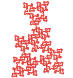
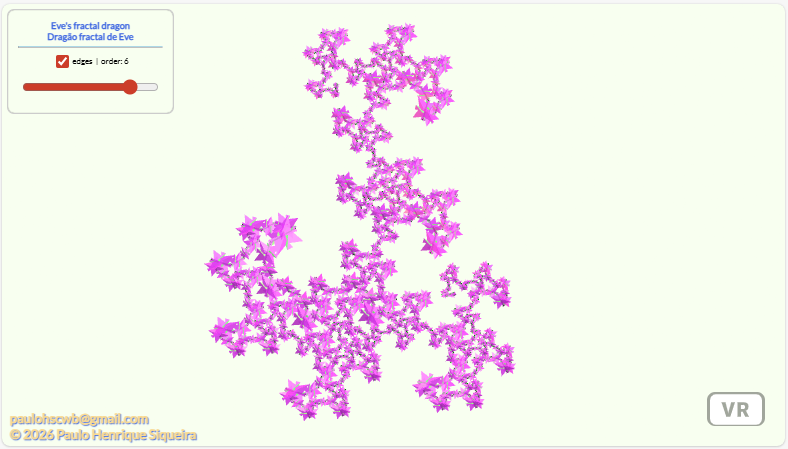

<link rel="stylesheet" href="scripts/style.css">
<meta charset="utf-8">
<link rel="icon" type="image/png" href="dragoneve/vr/salas/imagens/icone.png">
<h2>Visualization of Fractal curves with polyhedra in Virtual Reality (VR) with A-frame</h2>
 <b>author:</b> Paulo Henrique Siqueira - Universidade Federal do Paraná
  <b>contact:</b> <a href="#">paulohscwb@gmail.com</a>
  <a href="https://paulohscwb.github.io/fractalcurves/pt-br/">versão em português</a>
 

   In this work, the 3D models of fractal curves com poliedros can be seen in Virtual Reality (VR) and Augmented Reality (AR).

<h2>New fractal curves models</h2>
<h3 style="margin-top:3px"><a target="_blank" href="dragoneve/"> Dragon of Eve</a></h3>
<!--<h3 style="margin-top:3px"><a target="_blank" href="et/"> E.T. the extra-terrestrial curve</a></h3>--> 

<h2>Previous fractal curves models</h2>
<h3 style="margin-top:3px"><a target="_blank" href="https://paulohscwb.github.io/polyhedra2/fractalplatonic/"> Platonic polyhedra fractals</a></h3>
<h3 style="margin-top:3px"><a target="_blank" href="https://paulohscwb.github.io/polyhedra2/fractalnonconvex/"> Non convex polyhedra fractals 1</a></h3>
<h3 style="margin-top:3px"><a target="_blank" href="https://paulohscwb.github.io/polyhedra2/fractalarchimedean/"> Archimedean polyhedra fractals</a></h3>
<h3 style="margin-top:3px"><a target="_blank" href="https://paulohscwb.github.io/polyhedra3/dragon-archimedes/"> Archimedes and Catalan Dragon Fractals</a></h3>
<h3 style="margin-top:3px"><a target="_blank" href="https://paulohscwb.github.io/polyhedra3/dragon-nonconvex/"> Dragon fractals of non-convex polyhedra</a></h3>

<h3 align="center">Virtual Reality</h3>

<h3 align="center">3D models</h3>

 The orbit scripts developed by <b>Kevin Ngo</b> were used in the Virtual Reality pages of the 3D models: <a href="https://github.com/supermedium/superframe/tree/master/components/orbit-controls/" target="_blank"> Orbit controls for A-Frame</a>.
 The teleport scripts developed by <b>Fernando Serrano</b> were used in the Virtual Reality pages of the 3D models: <a  href="https://aframe.io/blog/teleport-component/" target="_blank"> Developing an A-Frame Teleport Component</a>
 

  Fractal curves with polyhedra: Visualization with Virtual Reality by <a xmlns:cc="http://creativecommons.org/ns#" href="https://paulohscwb.github.io/fractalcurves/" property="cc:attributionName" rel="cc:attributionURL">Paulo Henrique Siqueira</a> is licensed with a license <a rel="license" href="http://creativecommons.org/licenses/by-nc-nd/4.0/">Creative Commons Attribution-NonCommercial-NoDerivatives 4.0 International</a>.

<h4>How to cite this work:</h4> 

Siqueira, P.H., "Fractal curves with polyhedra: Visualization with Virtual Reality". Available in: <https://paulohscwb.github.io/fractalcurves/>, February 2026.

<!---->

 <b>References:</b>
 Ventrella, Jeffrey. "Fractal curves". <a href="http://fractalcurves.com/" target="_blank">http://fractalcurves.com/</a>
 Weisstein, Eric W. "Archimedean Solid" From MathWorld-A Wolfram Web Resource. <a href="http://mathworld.wolfram.com/ArchimedeanSolid.html" target="_blank">http://mathworld.wolfram.com/ArchimedeanSolid.html</a>
 Weisstein, Eric W. "Platonic Solid" From MathWorld-A Wolfram Web Resource. <a href="http://mathworld.wolfram.com/PlatonicSolid.html" target="_blank">http://mathworld.wolfram.com/PlatonicSolid.html</a>
 Weisstein, Eric W. "Archimedean Dual" From MathWorld-A Wolfram Web Resource. <a href="https://mathworld.wolfram.com/ArchimedeanDual.html" target="_blank">https://mathworld.wolfram.com/ArchimedeanDual.html</a>
 Weisstein, Eric W. "Uniform Polyhedron." From MathWorld--A Wolfram Web Resource. <a href="https://mathworld.wolfram.com/UniformPolyhedron.html" target="_blank">https://mathworld.wolfram.com/UniformPolyhedron.html</a>
 Wikipedia <a href="https://en.wikipedia.org/wiki/Archimedean_solid" target="_blank">https://en.wikipedia.org/wiki/Archimedean_solid</a>
 Wikipedia <a href="https://en.wikipedia.org/wiki/en.wikipedia.org/wiki/Platonic_solid" target="_blank">https://en.wikipedia.org/wiki/Platonic_solid</a>
 McCooey, David I. "Visual Polyhedra". <a href="http://dmccooey.com/polyhedra/" target="_blank">http://dmccooey.com/polyhedra/</a>
