<link rel="stylesheet" href="../../scripts/style.css">
<meta charset="utf-8">
<link rel="icon" type="image/png" href="../vr/salas/imagens/icone.png">
<h2>Visualização de Curvas Fractais de poliedros em Realidade Virtual (RV) com A-frame</h2>
<b>autor:</b> Paulo Henrique Siqueira - Universidade Federal do Paraná
 <b>contato:</b> <a href="#"> paulohscwb@gmail.com </a>
 <a href="https://paulohscwb.github.io/fractalcurves/dragoneve/">english version</a>
<form style="margin: 0 auto; float:right; text-align:right; width:100%; margin-bottom:15px;">
	<select id="url" onchange="urlHandler(this.value)" style="color:royalblue;">
		<option disabled selected>Mais sólidos:</option>
		<option disabled value="../../dragoneve/pt-br/">Dragão de Eva</option>
		<!--<option value="../../et/pt-br/">Curva do E.T., o extra-terrestre</option>-->
	</select>
</form>

  <h2 align="center">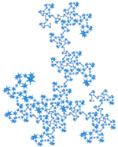 Fractais Dragão de Eva com poliedros</h2>
  A Curva do Dragão de Eva foi descoberta por Jeffrey Ventrella na década de 1980, e recebeu esse nome em homenagem à professora de arte de sua mãe. Uma das diferenças entre o Dragão de Eva e a Curva do Dragão clássica é a variação no comprimento de seus segmentos, devido ao fato de o segmento central do gerador ter comprimento igual a &radic;2, enquanto os demais segmentos têm comprimento igual a 1.
  

 Este trabalho mostra fractais dragão de Eva com poliedros, modelados para visualização em Realidade Virtual.
 
<a href="#m3d">Modelos 3D</a>&nbsp;&nbsp;|&nbsp;&nbsp;<a href="../../pt-br/">Página Inicial</a>

  

 

<h3 id="m3d" align="center">Modelos 3D</h3>
<!--<iframe width="560" height="315" style="max-width:100%" src="https://www.youtube.com/embed/videoseries?list=PLy0I_lGW8HxWGmFjnLlbixXP2VZLbEBW3" title="YouTube video player" frameborder="0" allow="accelerometer; autoplay; clipboard-write; encrypted-media; gyroscope; picture-in-picture; web-share" allowfullscreen></iframe>-->
<h4>1. Tetraedro</h4>
<a href="../vr/curve1.htm" target="_blank" title="modelo 3D" class="fotoA">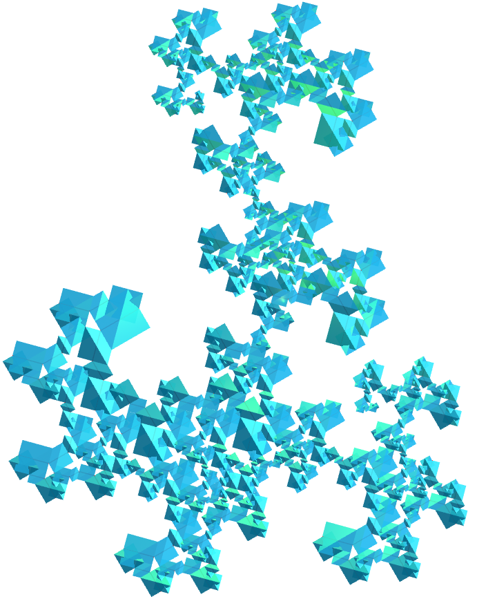</a>
  Aplicando o princípio de construção da curva do dragão de Eva com o tetraedro, obtemos um fractal dragão de Eva de tetraedro. Na primeira ordem de construção do fractal, construímos dois novos tetraedros correspondentes a um poliedro original. Neste exemplo, temos representações sólidas em ordens de 0 a 7.
  

<h4>2. Cubo</h4>
<a href="../vr/curve2.htm" target="_blank" title="modelo 3D" class="fotoA">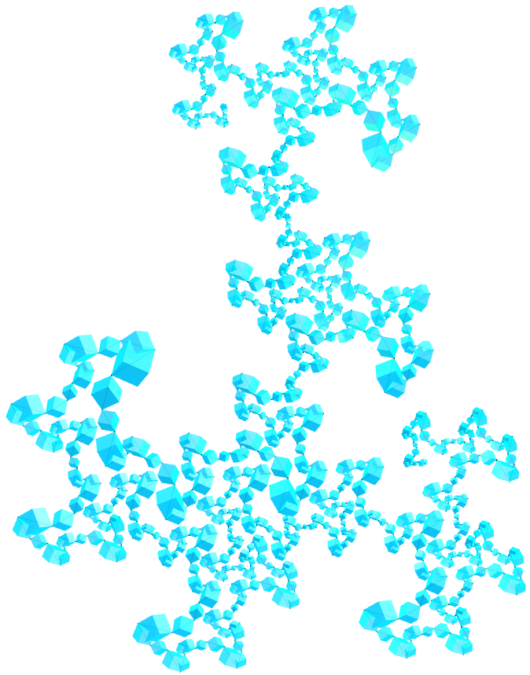</a>
  Fractal dragão de Eva do cubo.
  

<h4>3. Dodecaedro</h4>

  Fractal dragão de Eva do dodecaedro.
  

<h4>4. Icosaedro</h4>
<a href="../vr/curve4.htm" target="_blank" title="modelo 3D" class="fotoA">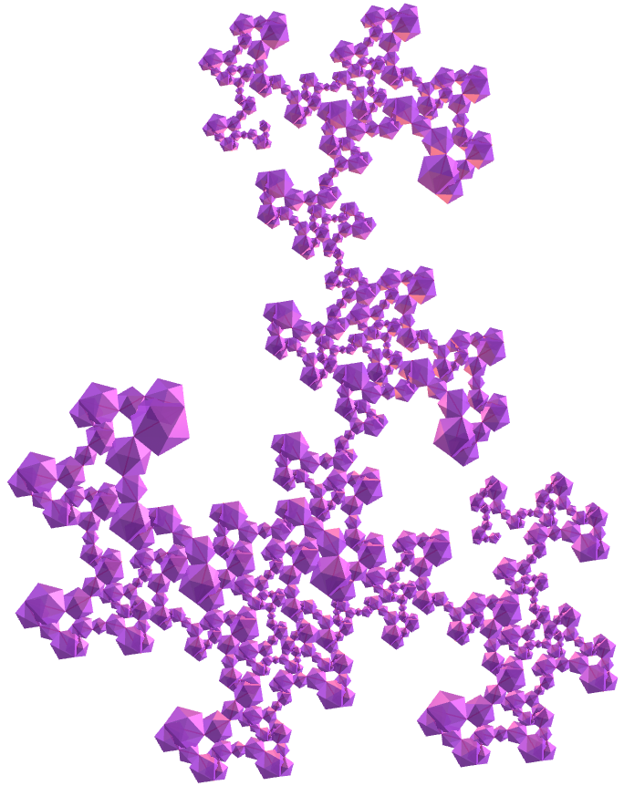</a>
  Fractal dragão de Eva do icosaedro.
  

<h4>5. Octaedro</h4>
<a href="../vr/curve5.htm" target="_blank" title="modelo 3D" class="fotoA">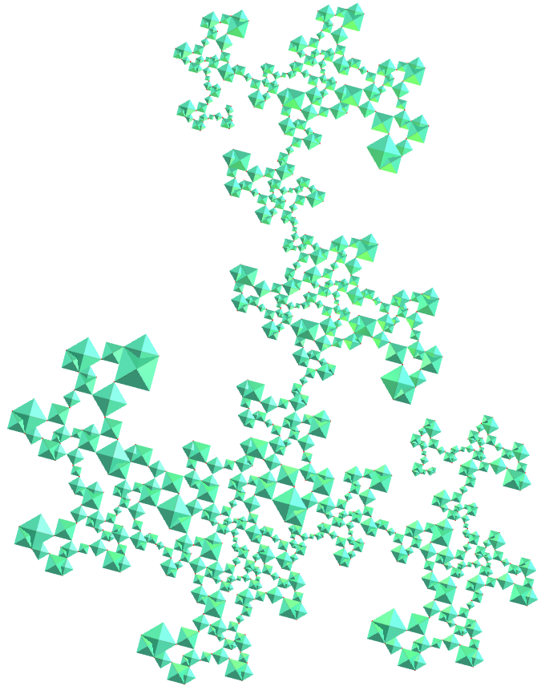</a>
  Fractal dragão de Eva do octaedro.
  

<h4>6. Grande dodecaedro</h4>
<a href="../vr/curve6.htm" target="_blank" title="modelo 3D" class="fotoA">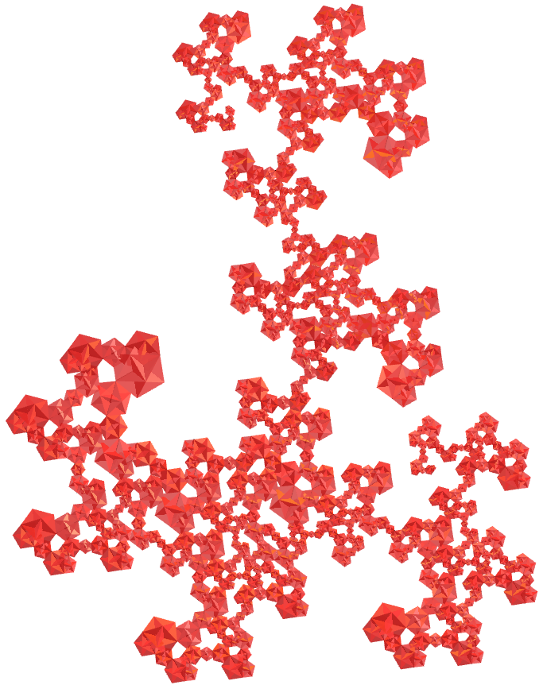</a>
  Fractal dragão de Eva do grande dodecaedro.
  

<h4>7. Hexaedro tetrakis</h4>
<a href="../vr/curve7.htm" target="_blank" title="modelo 3D" class="fotoA">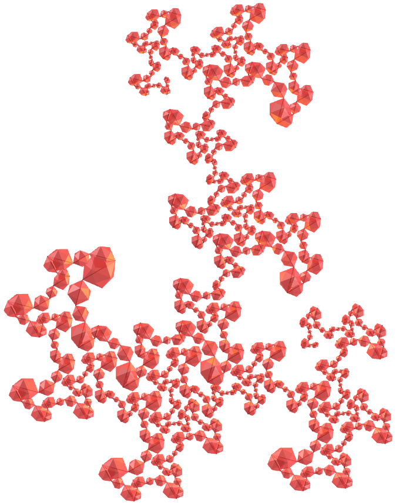</a>
  Fractal dragão de Eva do hexaedro tetrakis.
  

<h4>8. Grande icosaedro</h4>
<a href="../vr/curve8.htm" target="_blank" title="modelo 3D" class="fotoA">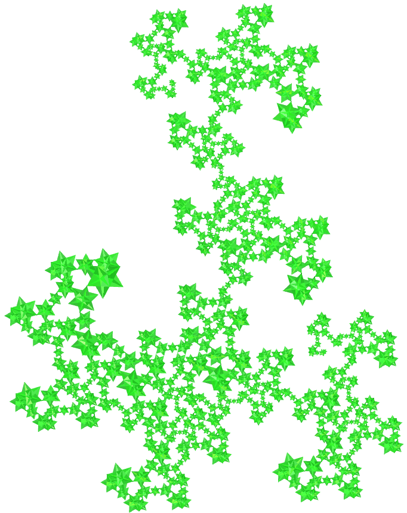</a>
  Fractal dragão de Eva do Grande icosaedro.
  

<h4>9. Grande icosaedro triakis</h4>

  Fractal dragão de Eva do Grande icosaedro triakis.
  

<h4>10. Sólido de Escher</h4>

  Fractal dragão de Eva do sólido de Escher.
  

<a href="#p1" class="topo">voltar ao topo</a>

<h4>11. Pequeno dodecaedro estrelado</h4>
<a href="../vr/curve11.htm" target="_blank" title="modelo 3D" class="fotoA">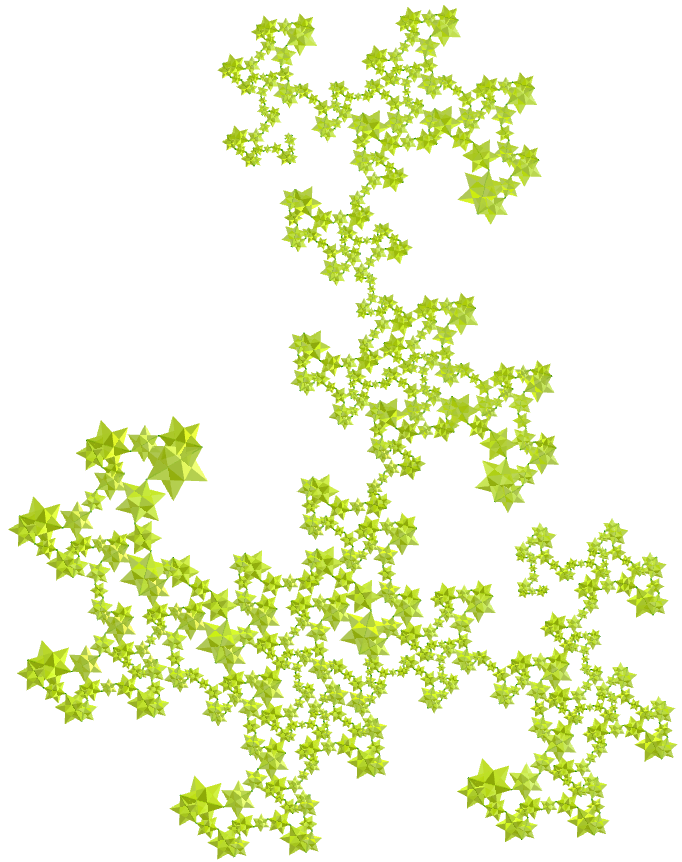</a>
  Fractal dragão de Eva do pequeno dodecaedro estrelado.
  

<h4>12. Grande dodecaedro estrelado</h4>
<a href="../vr/curve12.htm" target="_blank" title="modelo 3D" class="fotoA">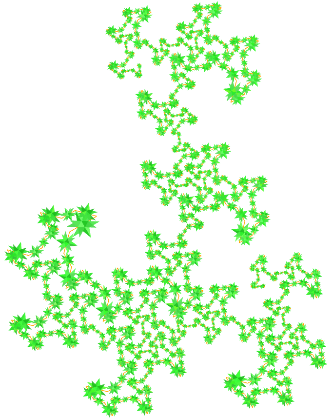</a>
  Fractal dragão de Eva do grande dodecaedro estrelado.
  

<h4>13. Cuboctaedro</h4>

  Fractal dragão de Eva do cuboctaedro.
  

<h4>14. Cubo snub</h4>
<a href="../vr/curve14.htm" target="_blank" title="modelo 3D" class="fotoA">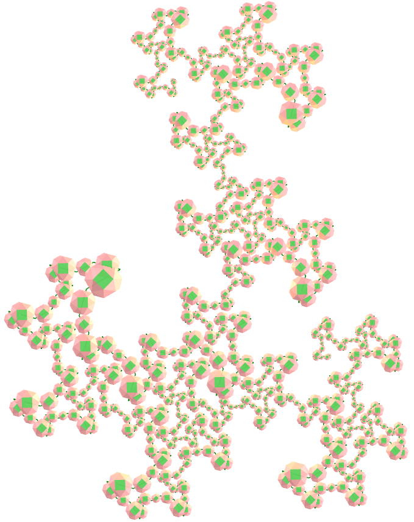</a>
  Fractal dragão de Eva do cubo snub.
  

<h4>15. Icosaedro truncado</h4>
<a href="../vr/curve15.htm" target="_blank" title="modelo 3D" class="fotoA">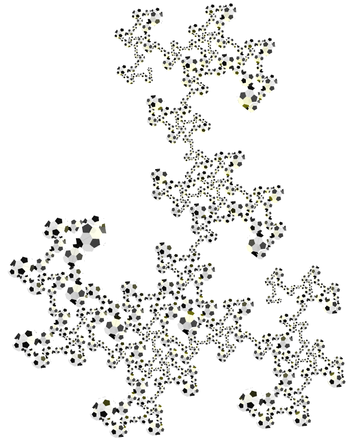</a>
  Fractal dragão de Eva do icosaedro truncado.
  

<h4>16. Dodecaedro snub</h4>
<a href="../vr/curve16.htm" target="_blank" title="modelo 3D" class="fotoA">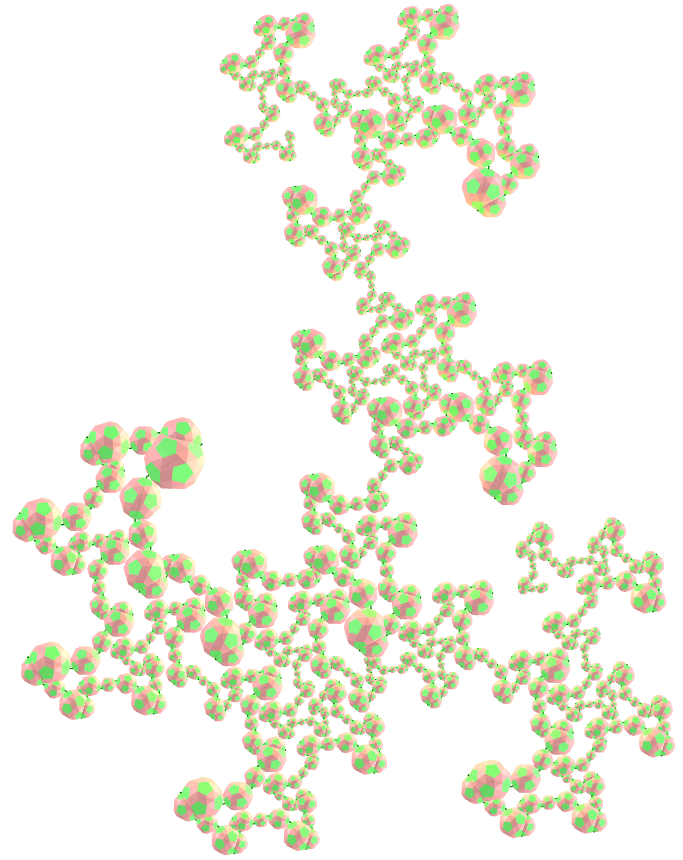</a>
  Fractal dragão de Eva do dodecaedro snub.
  

<h4>17. Tetrahemihexaedro</h4>
<a href="../vr/curve17.htm" target="_blank" title="modelo 3D" class="fotoA">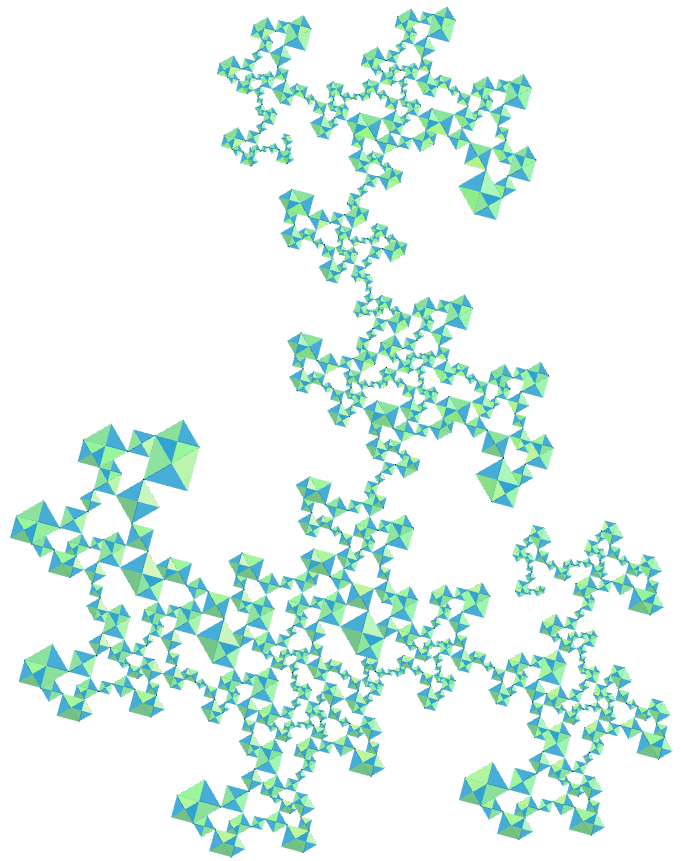</a>
  Fractal dragão de Eva do tetrahemihexaedro.
  

<h4>18. Tetrahemihexacron</h4>
<a href="../vr/curve18.htm" target="_blank" title="modelo 3D" class="fotoA">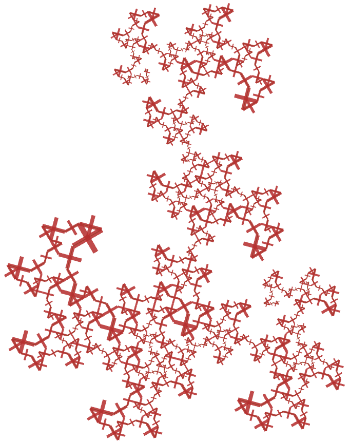</a>
  Fractal dragão de Eva do tetrahemihexacron.
  

<h4>19. Hexahemioctacron</h4>
<a href="../vr/curve19.htm" target="_blank" title="modelo 3D" class="fotoA">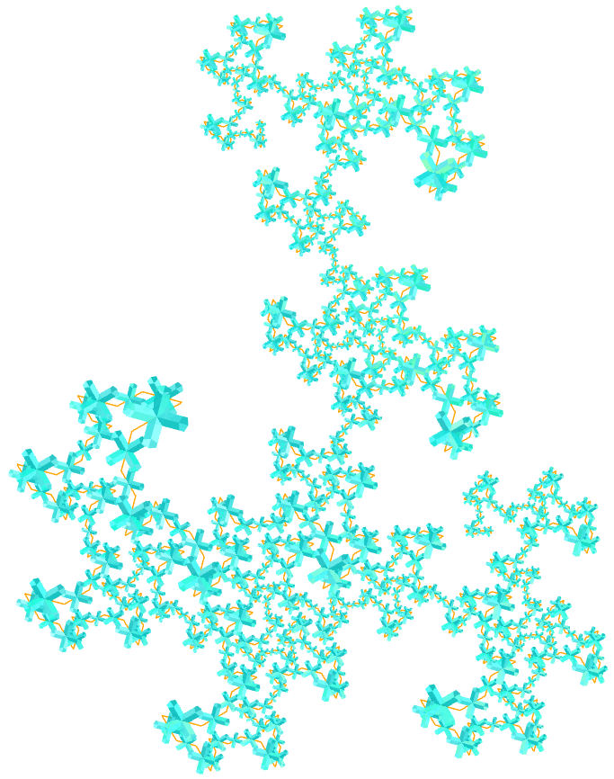</a>
  Fractal dragão de Eva do hexahemioctacron.
  

<h4>20. Pequeno icosihemidodecacron</h4>
<a href="../vr/curve20.htm" target="_blank" title="modelo 3D" class="fotoA">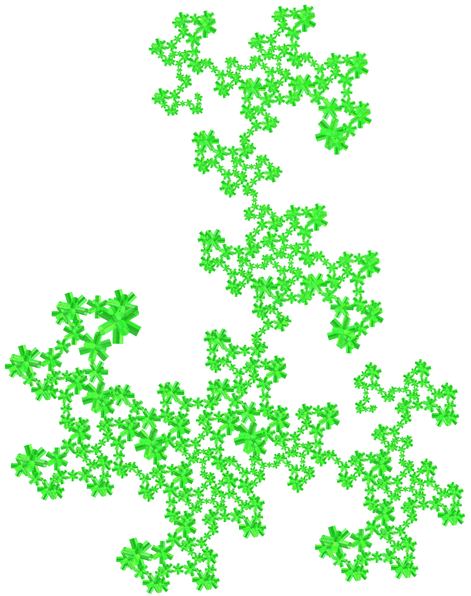</a>
  Fractal dragão de Eva do pequeno icosihemidodecacron.
  

<a href="#p1" class="topo">voltar ao topo</a>

<h4>21. Pequeno dodecahemicosaedro</h4>
<a href="../vr/curve21.htm" target="_blank" title="modelo 3D" class="fotoA">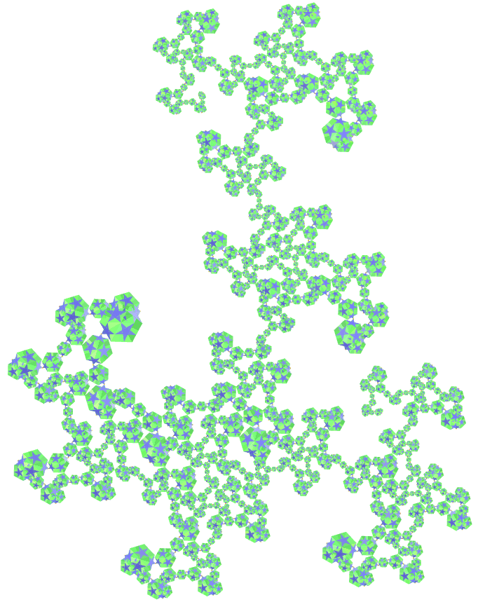</a>
  Fractal dragão de Eva do pequeno dodecahemicosaedro.
  

<h4>22. Grande dodecahemicosaedro</h4>

  Fractal dragão de Eva do grande dodecahemicosaedro.
  

<h4>23. Octaedro estrelado</h4>
<a href="../vr/curve23.htm" target="_blank" title="modelo 3D" class="fotoA">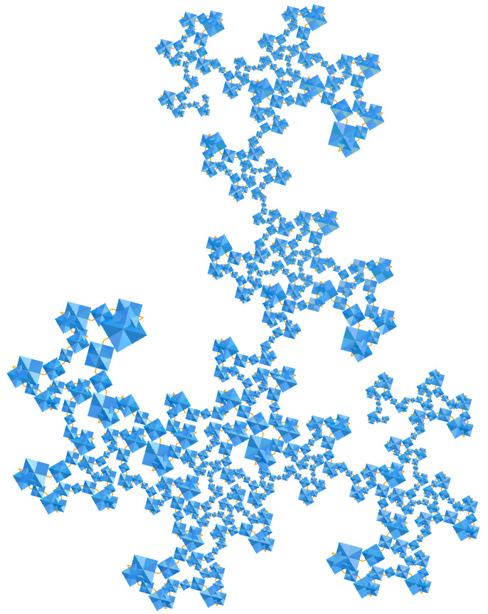</a>
  Fractal dragão de Eva do octaedro estrelado.
  

<h4>24. Dodecaedro côncavo</h4>
<a href="../vr/curve24.htm" target="_blank" title="modelo 3D" class="fotoA">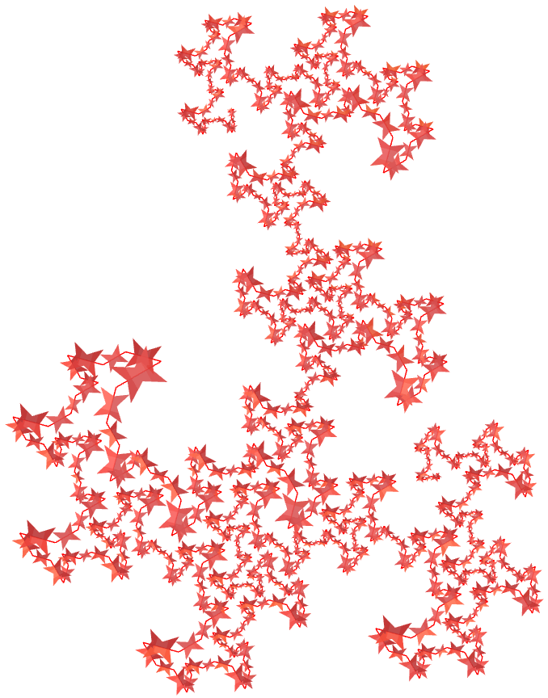</a>
  Fractal dragão de Eva do dodecaedro côncavo.
  

<h4>25. Icosaedro ortogonal de Jessen</h4>
<a href="../vr/curve25.htm" target="_blank" title="modelo 3D" class="fotoA">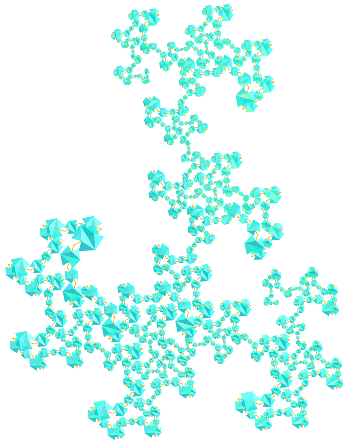</a>
  Fractal dragão de Eva do icosaedro ortogonal de Jessen.
  

<h4>26. Dodecaedro diakis</h4>

  Fractal dragão de Eva do dodecaedro diakis.
  

<h4>27. Pequeno icositetraedro hexacrônico</h4>
<a href="../vr/curve27.htm" target="_blank" title="modelo 3D" class="fotoA">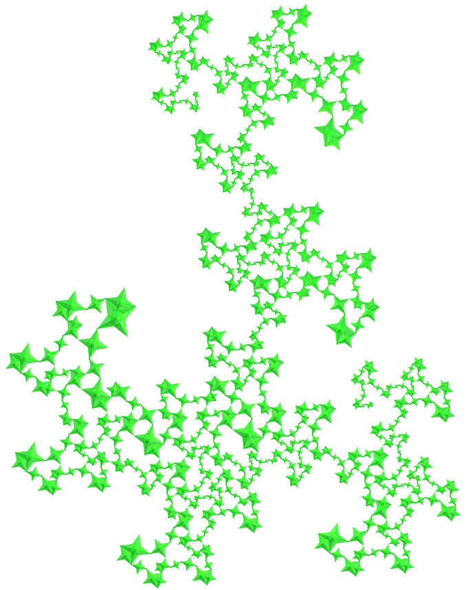</a>
  Fractal dragão de Eva do pequeno icositetraedro hexacrônico.
  

<h4>28. Grande icositetraedro hexacrônico</h4>
<a href="../vr/curve28.htm" target="_blank" title="modelo 3D" class="fotoA">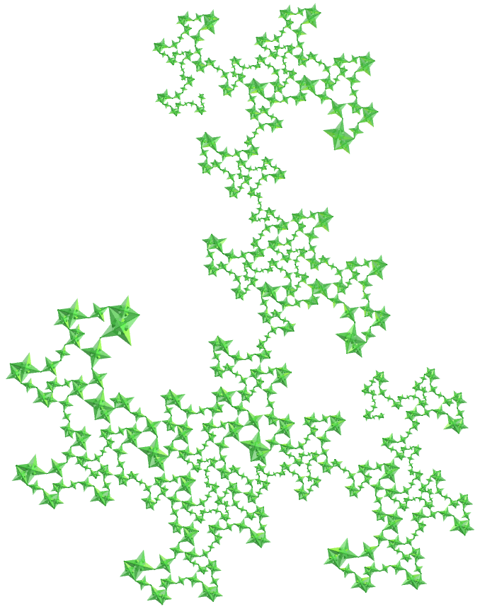</a>
  Fractal dragão de Eva do grande icositetraedro hexacrônico.
  

<h4>29. Pequeno icosicosidodecaedro</h4>
<a href="../vr/curve29.htm" target="_blank" title="modelo 3D" class="fotoA">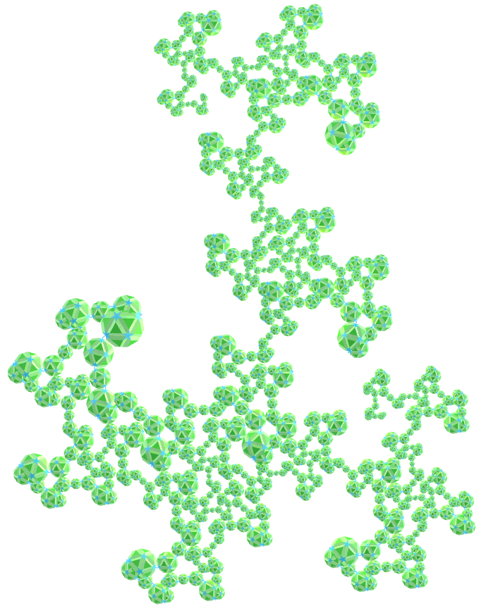</a>
  Fractal dragão de Eva do pequeno icosicosidodecaedro.
  

<h4>30. Dodecadodecaedro</h4>
<a href="../vr/curve30.htm" target="_blank" title="modelo 3D" class="fotoA">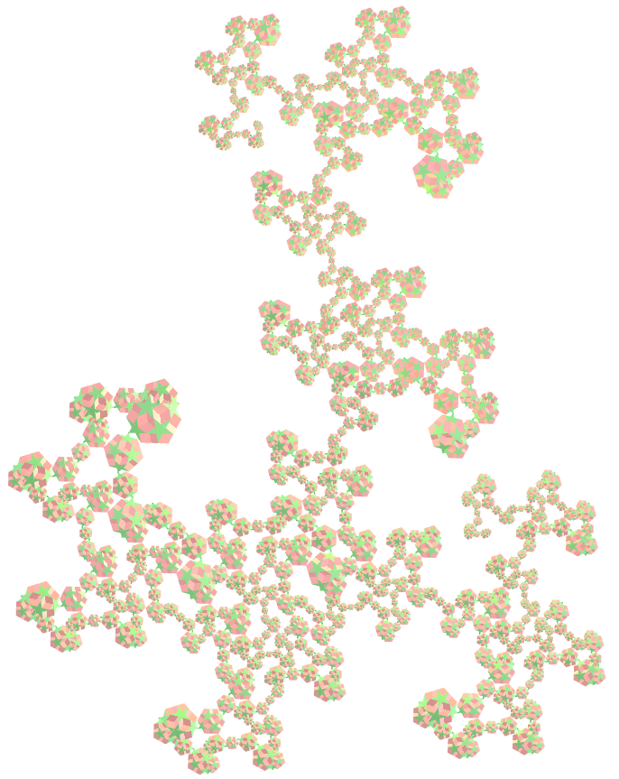</a>
  Fractal dragão de Eva do dodecadodecaedro.
  

<a href="#p1" class="topo">voltar ao topo</a>

<h4>31. Triacontaedro rômbico medial</h4>

  Fractal dragão de Eva do triacontaedro rômbico medial.
  

<h4>32. Icosaedro triâmbico medial</h4>
<a href="../vr/curve32.htm" target="_blank" title="modelo 3D" class="fotoA">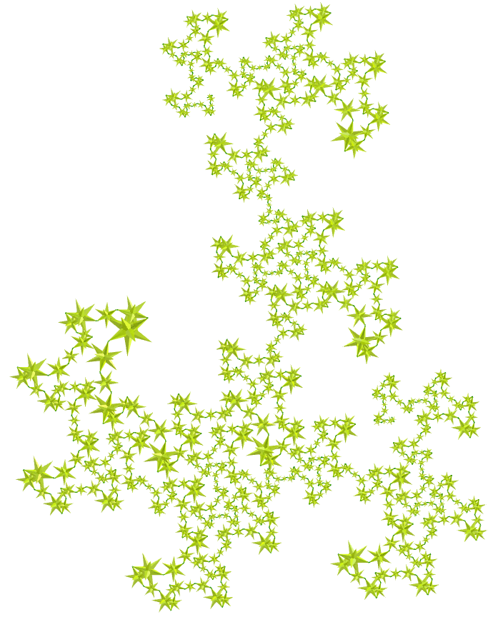</a>
  Fractal dragão de Eva do icosaedro triâmbico medial.
  

<h4>33. Pequeno hexecontaedro ditrigonal dodecacrônico</h4>
<a href="../vr/curve33.htm" target="_blank" title="modelo 3D" class="fotoA">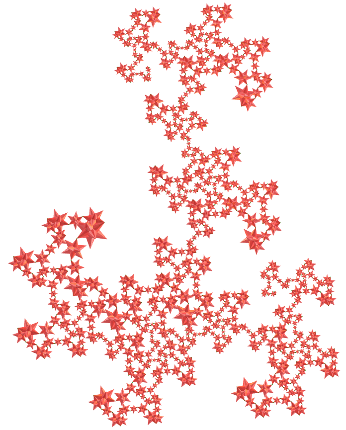</a>
  Fractal dragão de Eva do pequeno hexecontaedro ditrigonal dodecacrônico.
  

<h4>34. Grande icosaedro triâmbico</h4>

  Fractal dragão de Eva do grande icosaedro triâmbico.
  

<h4>35. Grande cubicuboctaedro</h4>
<a href="../vr/curve35.htm" target="_blank" title="modelo 3D" class="fotoA">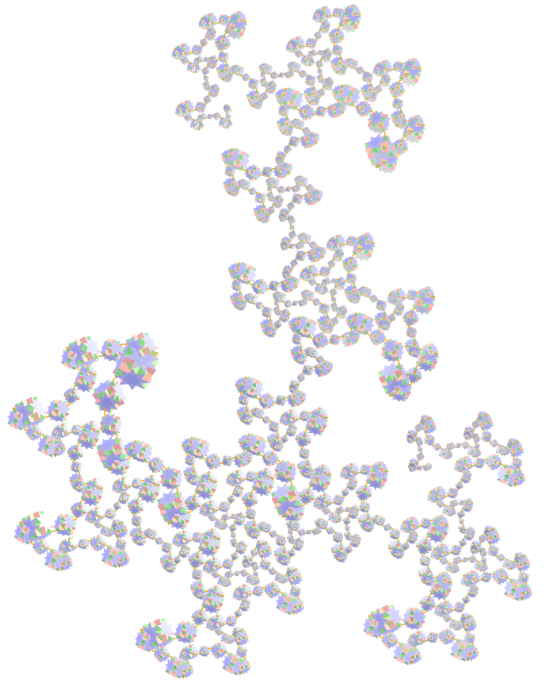</a>
  Fractal dragão de Eva do grande cubicuboctaedro.
  

<h4>36. Grande rombicuboctaedro uniforme</h4>

  Fractal dragão de Eva do grande rombicuboctaedro uniforme.
  

<h4>37. Grande rombihexaedro</h4>
<a href="../vr/curve37.htm" target="_blank" title="modelo 3D" class="fotoA">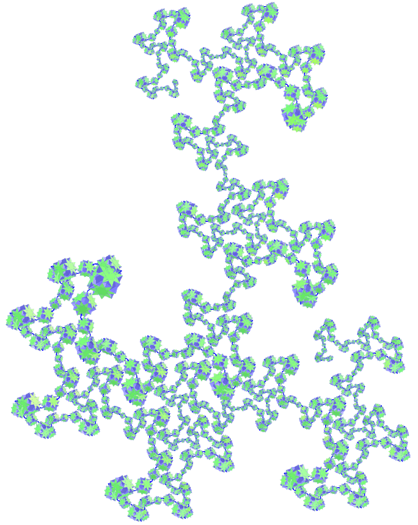</a>
  Fractal dragão de Eva do grande rombihexaedro.
  

<h4>38. Pequeno rombihexacro</h4>

  Fractal dragão de Eva do pequeno rombihexacro.
  

<h4>39. Grande rombihexacro</h4>

  Fractal dragão de Eva do grande rombihexacro.
  

<h4>40. Pequeno dodecicosacrono</h4>

  Fractal dragão de Eva do pequeno dodecicosacrono.
  

<a href="#p1" class="topo">voltar ao topo</a>

<h4>41. Pequeno dodecicosaedro</h4>

  Fractal dragão de Eva do pequeno dodecicosaedro.
  

<h4>42. Rombicosaedro</h4>
<a href="../vr/curve42.htm" target="_blank" title="modelo 3D" class="fotoA">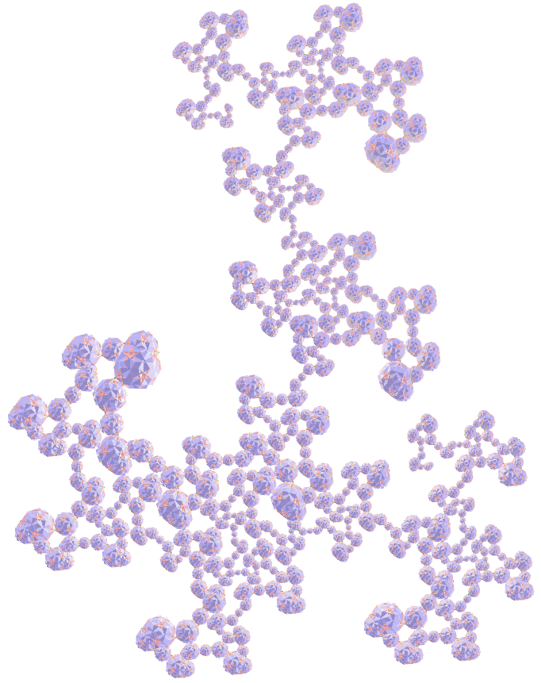</a>
  Fractal dragão de Eva do rombicosaedro.
  

<h4>43. Rombicosacro</h4>
<a href="../vr/curve43.htm" target="_blank" title="modelo 3D" class="fotoA">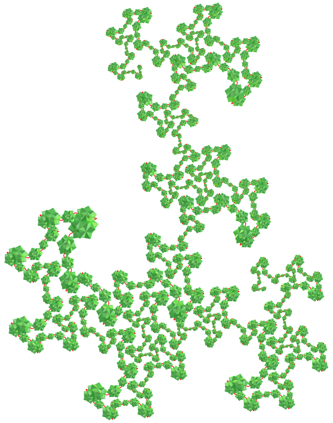</a>
  Fractal dragão de Eva do rombicosacro.
  

<h4>44. Cuboctaedro cubitruncado</h4>

  Fractal dragão de Eva do cuboctaedro cubitruncado.
  

<h4>45. Hexaedro tetradiakis</h4>
<a href="../vr/curve45.htm" target="_blank" title="modelo 3D" class="fotoA">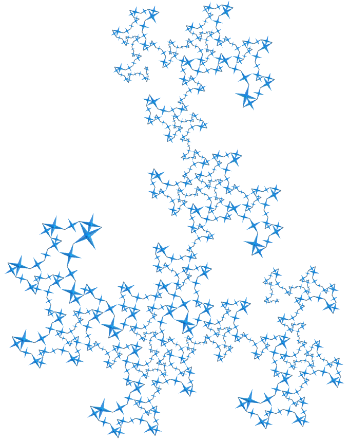</a>
  Fractal dragão de Eva do hexaedro tetradiakis.
  

<h4>46. Grande octaedro triakis</h4>
<a href="../vr/curve46.htm" target="_blank" title="modelo 3D" class="fotoA">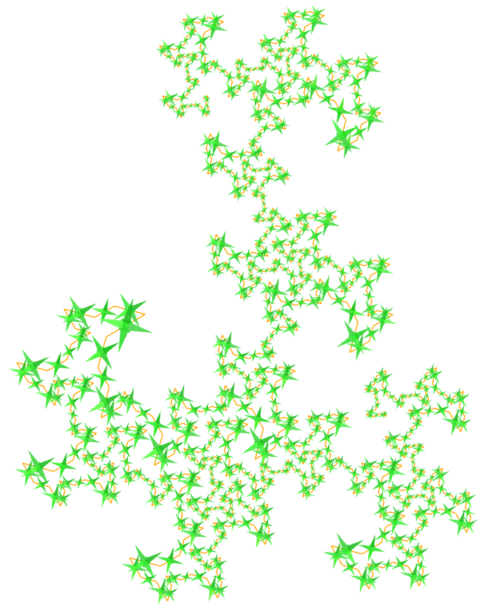</a>
  Fractal dragão de Eva do grande octaedro triakis.
  

<h4>47. Grande cuboctaedro truncado</h4>
<a href="../vr/curve47.htm" target="_blank" title="modelo 3D" class="fotoA">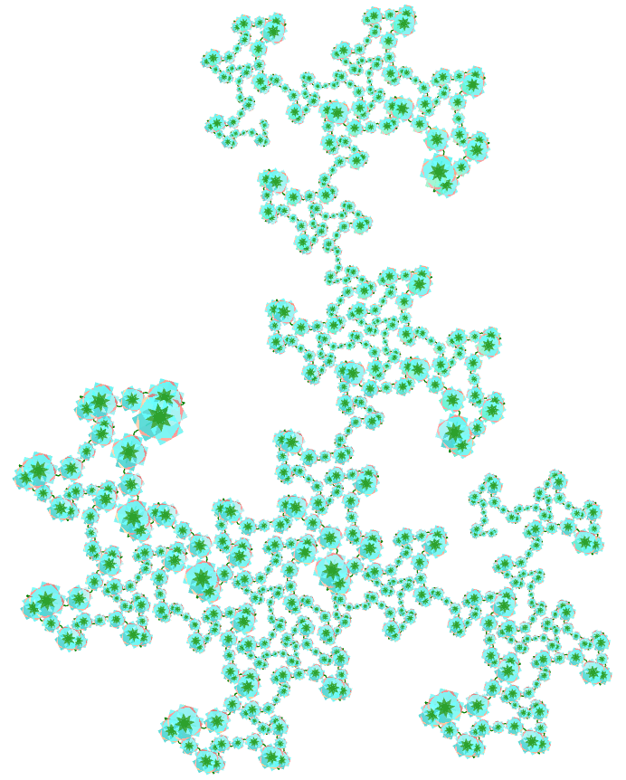</a>
  Fractal dragão de Eva do grande cuboctaedro truncado.
  

<h4>48. Grande dodecaedro disdiakis</h4>
<a href="../vr/curve48.htm" target="_blank" title="modelo 3D" class="fotoA">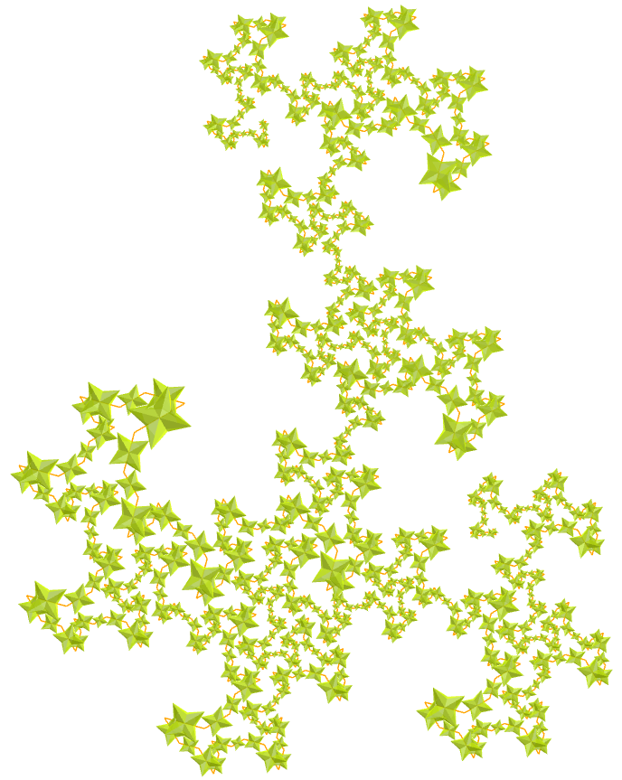</a>
  Fractal dragão de Eva do grande dodecaedro disdiakis.
  

<h4>49. Grande dodecaedro truncado</h4>
<a href="../vr/curve49.htm" target="_blank" title="modelo 3D" class="fotoA">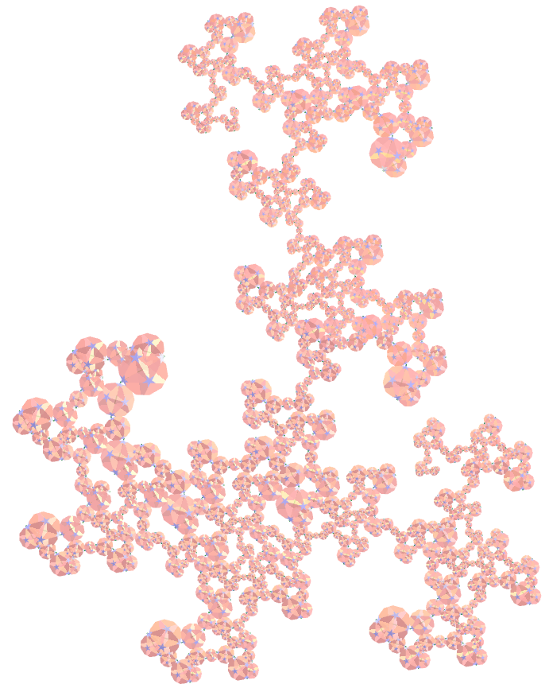</a>
  Fractal dragão de Eva do grande dodecaedro truncado.
  

<h4>50. Pequeno dodecaedro stellapentakis</h4>

  Fractal dragão de Eva do pequeno dodecaedro stellapentakis.
  

<a href="#p1" class="topo">voltar ao topo</a>

<h4>51. Icosaedro tridiakis</h4>
<a href="../vr/curve51.htm" target="_blank" title="modelo 3D" class="fotoA">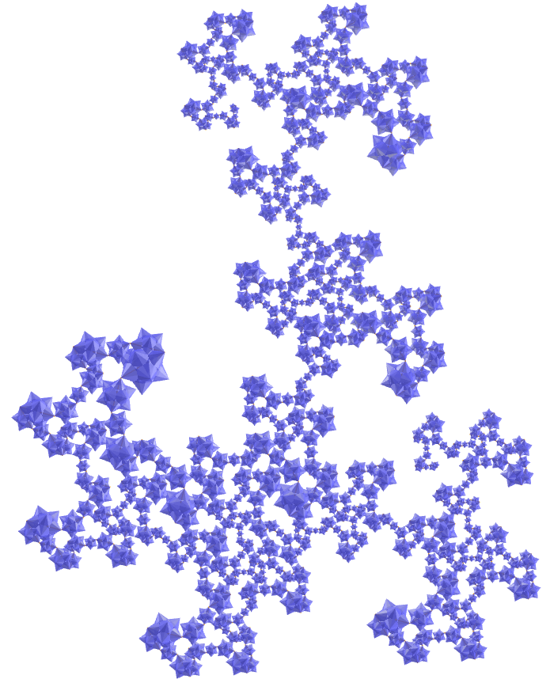</a>
  Fractal dragão de Eva do icosaedro tridiakis.
  

<h4>52. Grande icosaedro truncado</h4>
<a href="../vr/curve52.htm" target="_blank" title="modelo 3D" class="fotoA">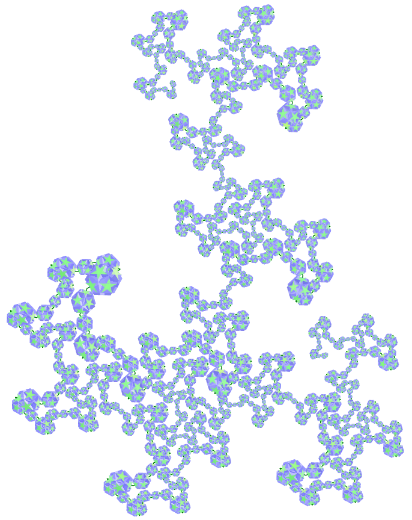</a>
  Fractal dragão de Eva do grande icosaedro truncado.
  

<h4>53. Grande dodecaedro stellapentakis</h4>
<a href="../vr/curve53.htm" target="_blank" title="modelo 3D" class="fotoA">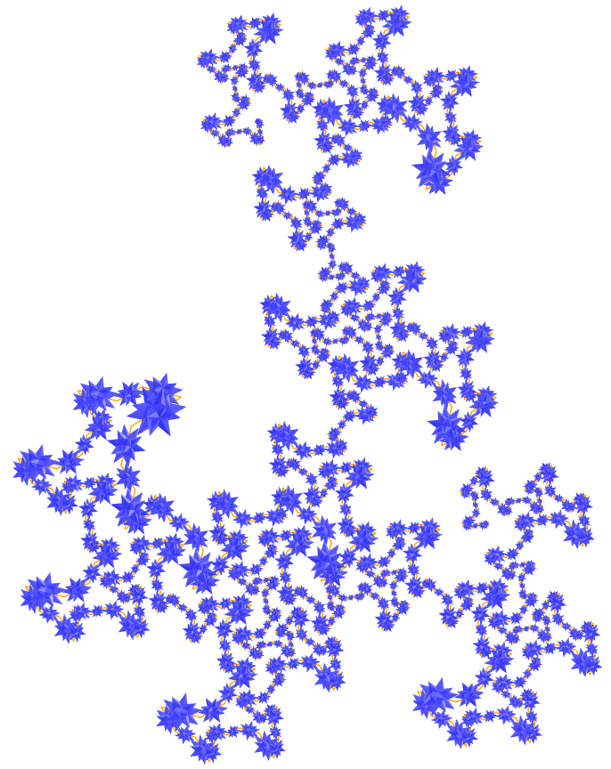</a>
  Fractal dragão de Eva do grande dodecaedro stellapentakis.
  

<h4>54. Triacontaedro disdiakis medial</h4>
<a href="../vr/curve54.htm" target="_blank" title="modelo 3D" class="fotoA">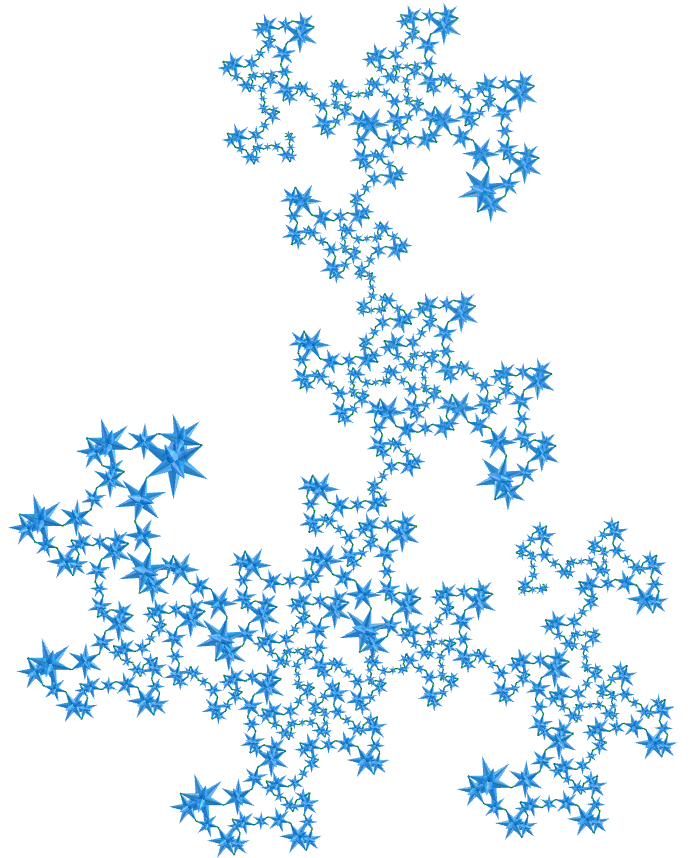</a>
  Fractal dragão de Eva do triacontaedro disdiakis medial.
  

<h4>55. Grande icosaedro triakis</h4>
<a href="../vr/curve55.htm" target="_blank" title="modelo 3D" class="fotoA">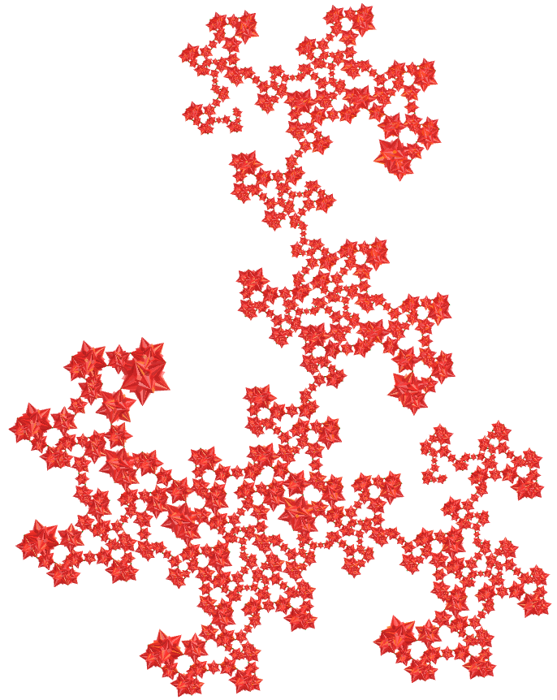</a>
  Fractal dragão de Eva do grande icosaedro triakis.
  

<h4>56. Grande triacontaedro disdiakis</h4>

  Fractal dragão de Eva do grande triacontaedro disdiakis.
  

<h4>57. Cubo truncado combinado</h4>
<a href="../vr/curve57.htm" target="_blank" title="modelo 3D" class="fotoA">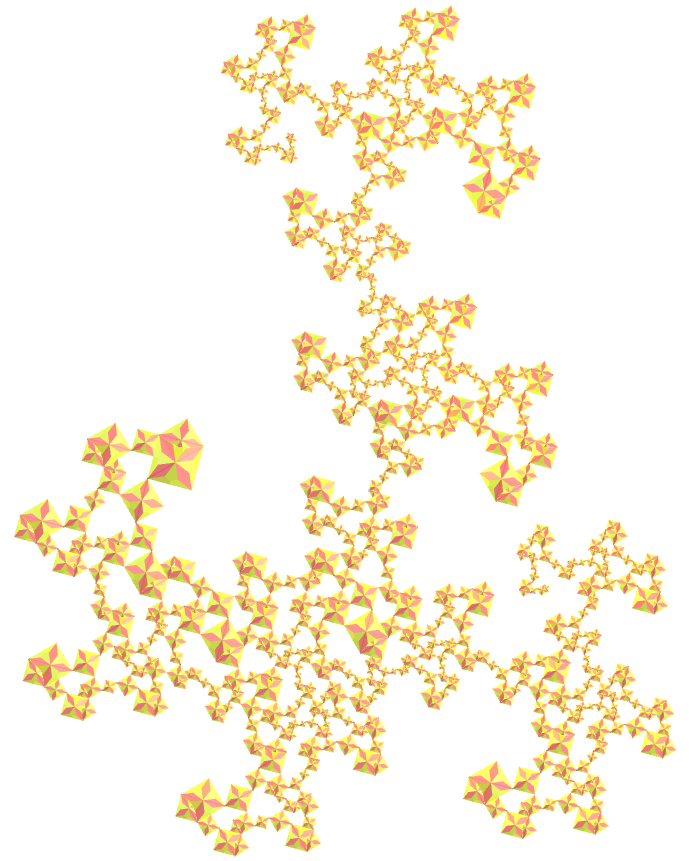</a>
  Fractal dragão de Eva do cubo truncado combinado.
  

<h4>58. Octaedro chanfrado</h4>
<a href="../vr/curve58.htm" target="_blank" title="modelo 3D" class="fotoA">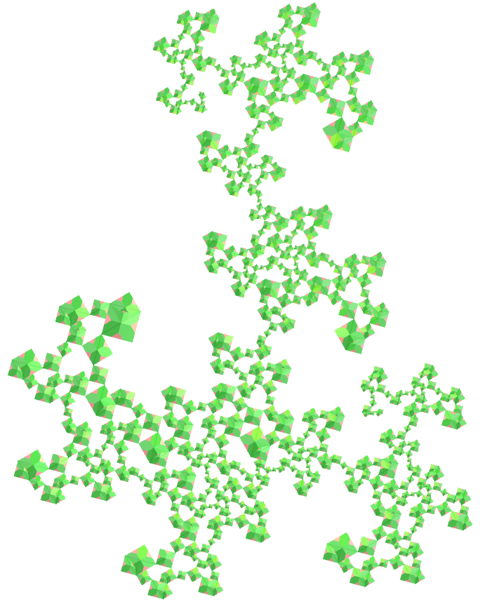</a>
  Fractal dragão de Eva do octaedro chanfrado.
  

<h4>59. Dodecaedro rômbico</h4>
<a href="../vr/curve59.htm" target="_blank" title="modelo 3D" class="fotoA">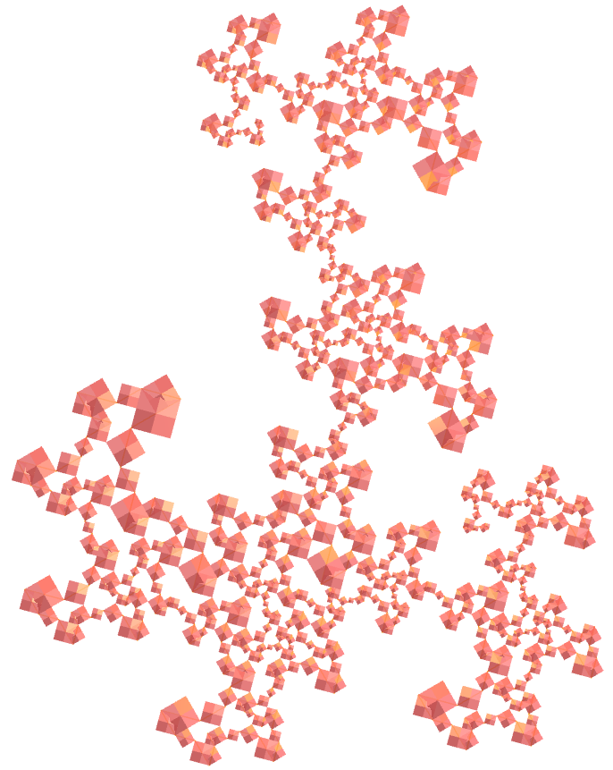</a>
  Fractal dragão de Eva do dodecaedro rômbico.
  

<h4>60. Octaedro triakis</h4>
<a href="../vr/curve60.htm" target="_blank" title="modelo 3D" class="fotoA">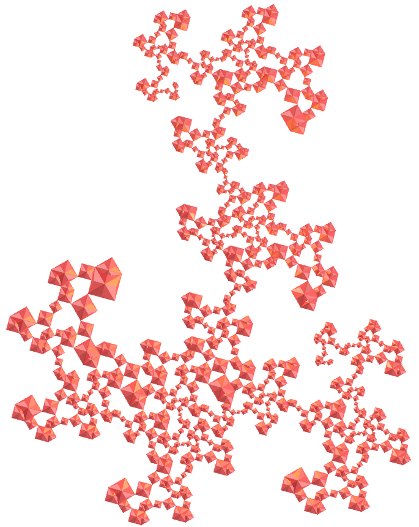</a>
  Fractal dragão de Eva do octaedro triakis.
  

<a href="#p1" class="topo">voltar ao topo</a>

<h4>61. Icositetraedro deltoidal</h4>

  Fractal dragão de Eva do icositetraedro deltoidal.
  

<h4>62. Icositetraedro pentagonal</h4>
<a href="../vr/curve62.htm" target="_blank" title="modelo 3D" class="fotoA">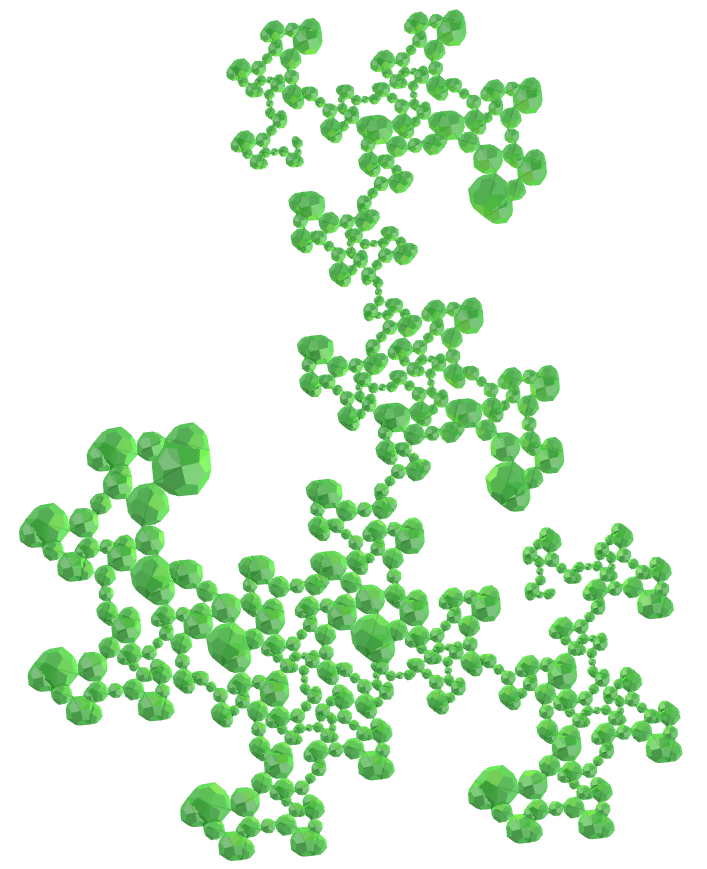</a>
  Fractal dragão de Eva do icositetraedro pentagonal.
  

<h4>63. Dodecaedro disdiakis</h4>
<a href="../vr/curve63.htm" target="_blank" title="modelo 3D" class="fotoA">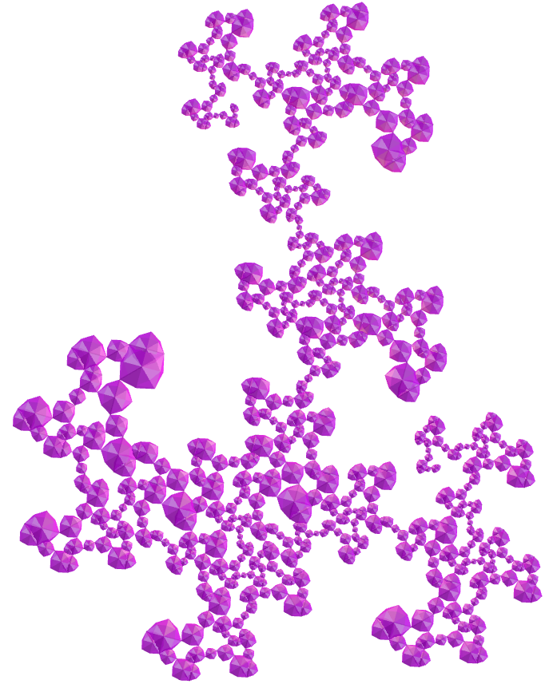</a>
  Fractal dragão de Eva do dodecaedro disdiakis.
  

<h4>64. Icosidodecaedro</h4>
<a href="../vr/curve64.htm" target="_blank" title="modelo 3D" class="fotoA">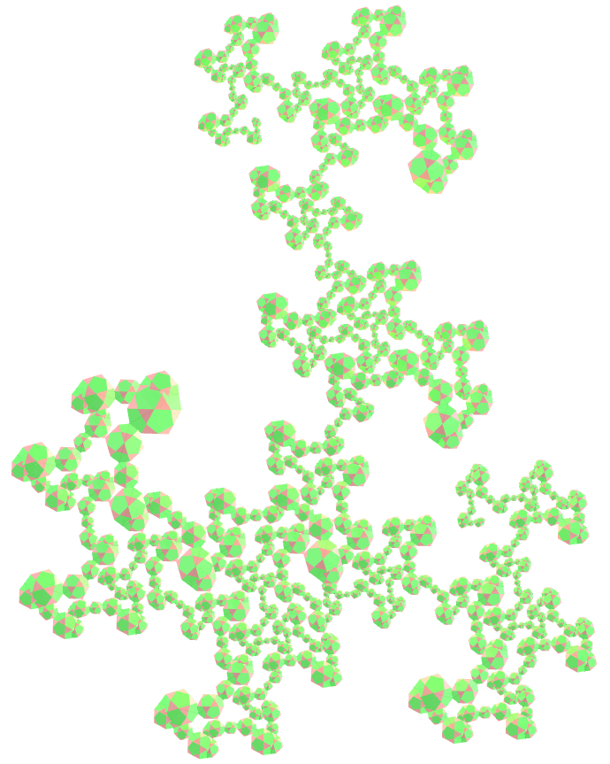</a>
  Fractal dragão de Eva do icosidodecaedro.
  

<h4>65. Rombicuboctaedro</h4>
<a href="../vr/curve65.htm" target="_blank" title="modelo 3D" class="fotoA">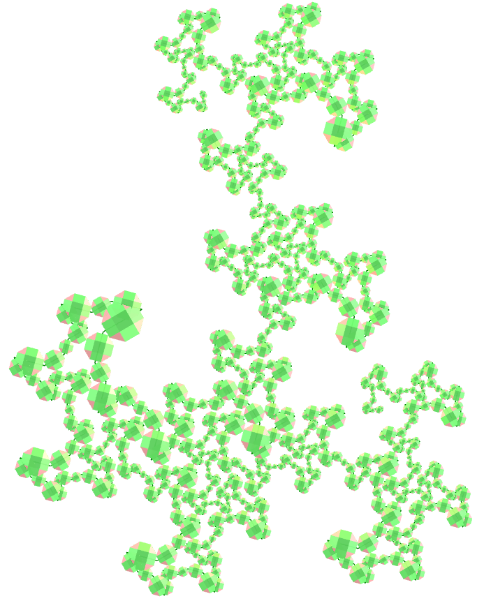</a>
  Fractal dragão de Eva do rombicuboctaedro.
  

<h4>66. Tetraedro truncado</h4>
<a href="../vr/curve66.htm" target="_blank" title="modelo 3D" class="fotoA">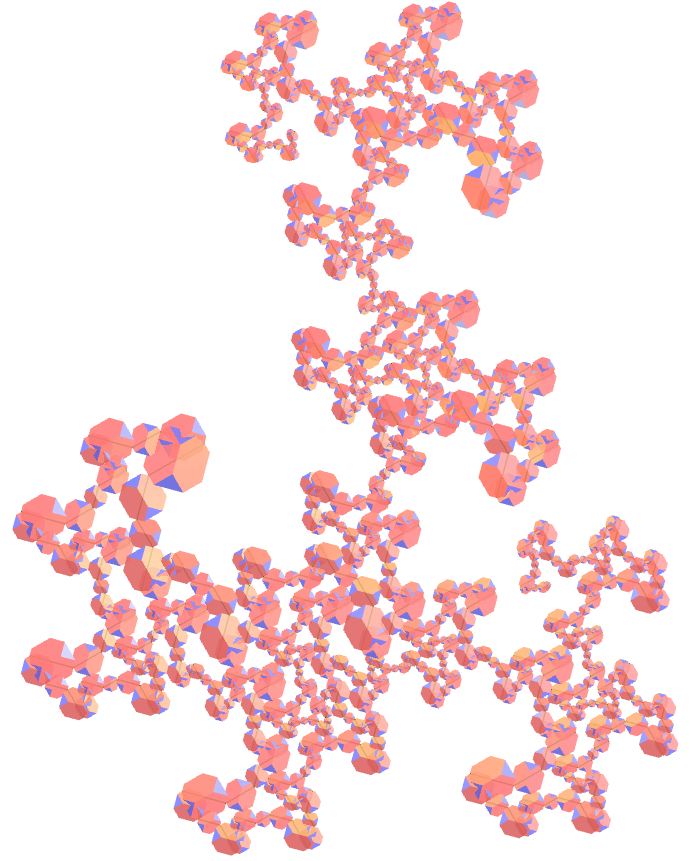</a>
  Fractal dragão de Eva do tetraedro truncado.
  

<h4>67. Dodecaedro hendecagonal</h4>
<a href="../vr/curve67.htm" target="_blank" title="modelo 3D" class="fotoA">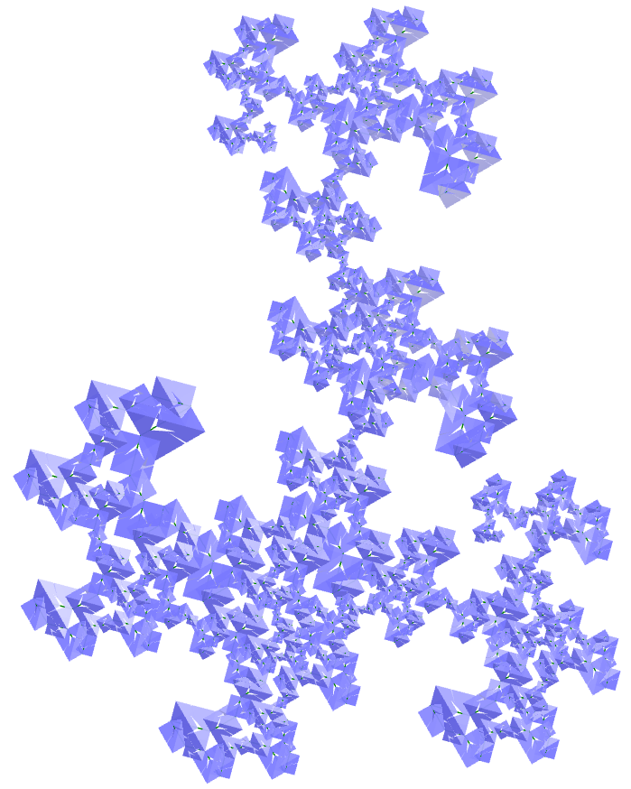</a>
  Fractal dragão de Eva do dodecaedro hendecagonal.
  

<h4>68. Mapa de Klein</h4>
<a href="../vr/curve68.htm" target="_blank" title="modelo 3D" class="fotoA">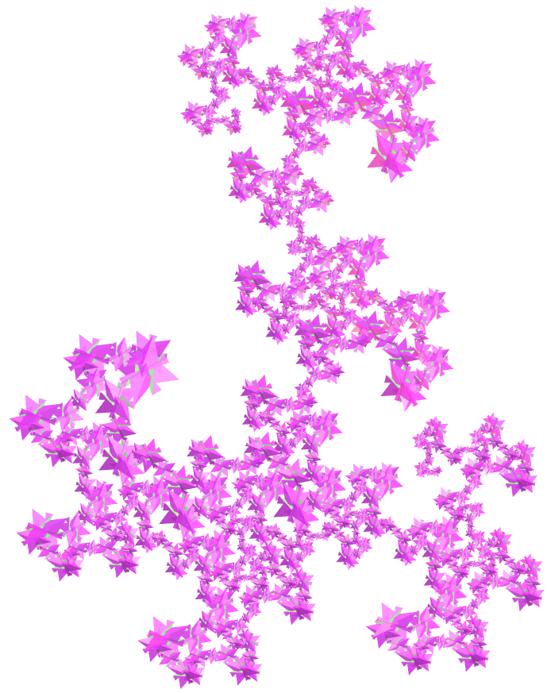</a>
  Fractal dragão de Eva do mapa de Klein.
  

<h4>69. Tetraedro truncado combinado</h4>
<a href="../vr/curve69.htm" target="_blank" title="modelo 3D" class="fotoA">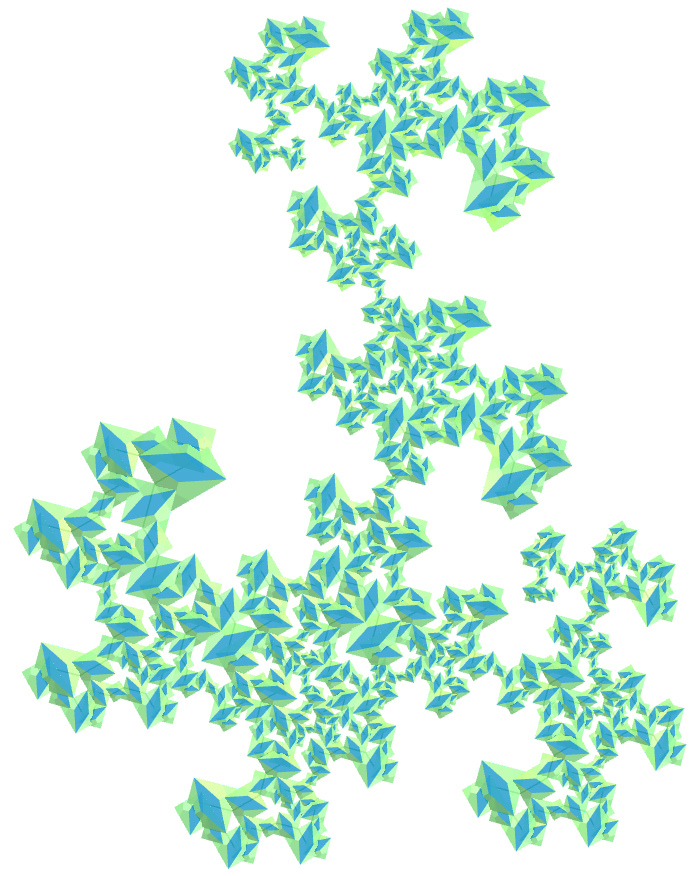</a>
  Fractal dragão de Eva do tetraedro truncado combinado.
  

<h4>70. Tetraedro triakis</h4>
<a href="../vr/curve70.htm" target="_blank" title="modelo 3D" class="fotoA">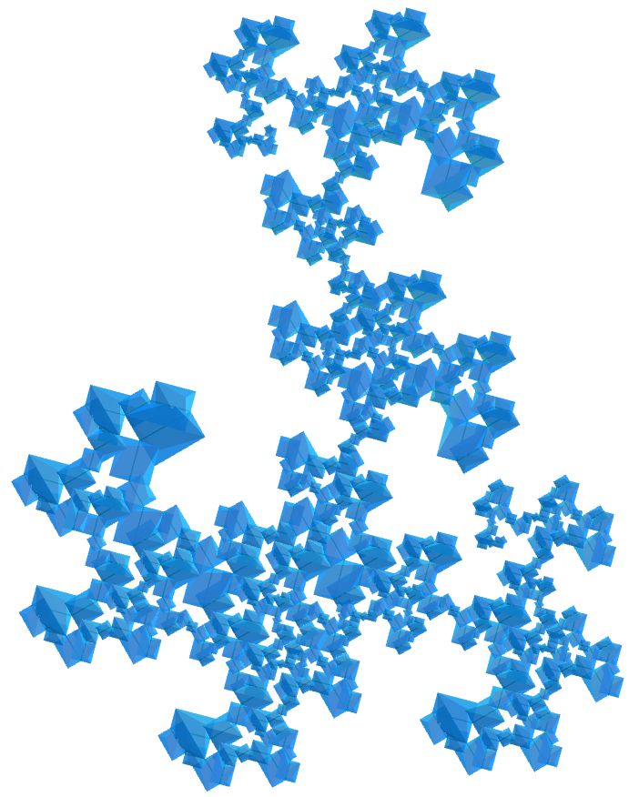</a>
  Fractal dragão de Eva do tetraedro triakis.
  

<a href="#p1" class="topo">voltar ao topo</a>

<h4>71. Dodecaedro truncado combinado</h4>
<a href="../vr/curve71.htm" target="_blank" title="modelo 3D" class="fotoA">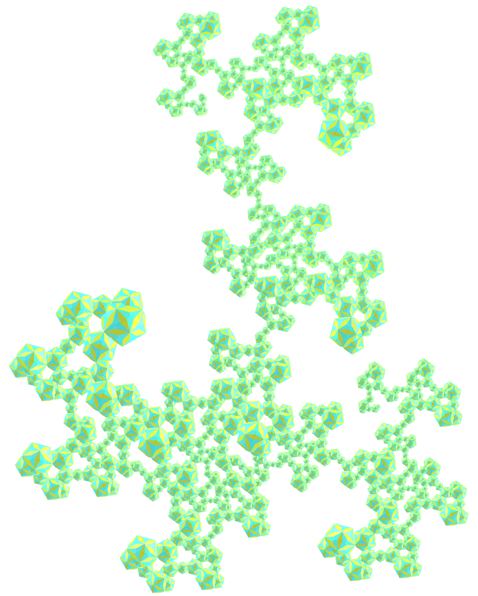</a>
  Fractal dragão de Eva do dodecaedro truncado combinado.
  

<h4>72. Cubo ortokis de hélice biscrito</h4>
<a href="../vr/curve72.htm" target="_blank" title="modelo 3D" class="fotoA">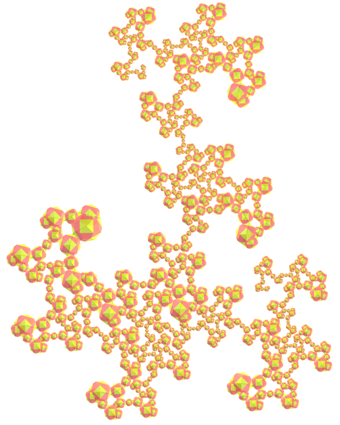</a>
  Fractal dragão de Eva do cubo ortokis de hélice biscrito.
  

<h4>73. Octaedro de hélice ortotruncado biscrito</h4>

  Fractal dragão de Eva do octaedro de hélice ortotruncado biscrito.
  

<h4>74. Toroide de Szilassi</h4>
<a href="../vr/curve74.htm" target="_blank" title="modelo 3D" class="fotoA">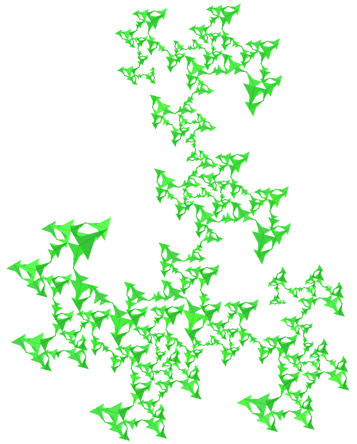</a>
  Fractal dragão de Eva do toroide de Szilassi.
  

<h4>75. Dodecaedro heptagonal</h4>

  Fractal dragão de Eva do dodecaedro heptagonal.
  

<h4>76. Dodecaedro heptagonal</h4>
<a href="../vr/curve76.htm" target="_blank" title="modelo 3D" class="fotoA">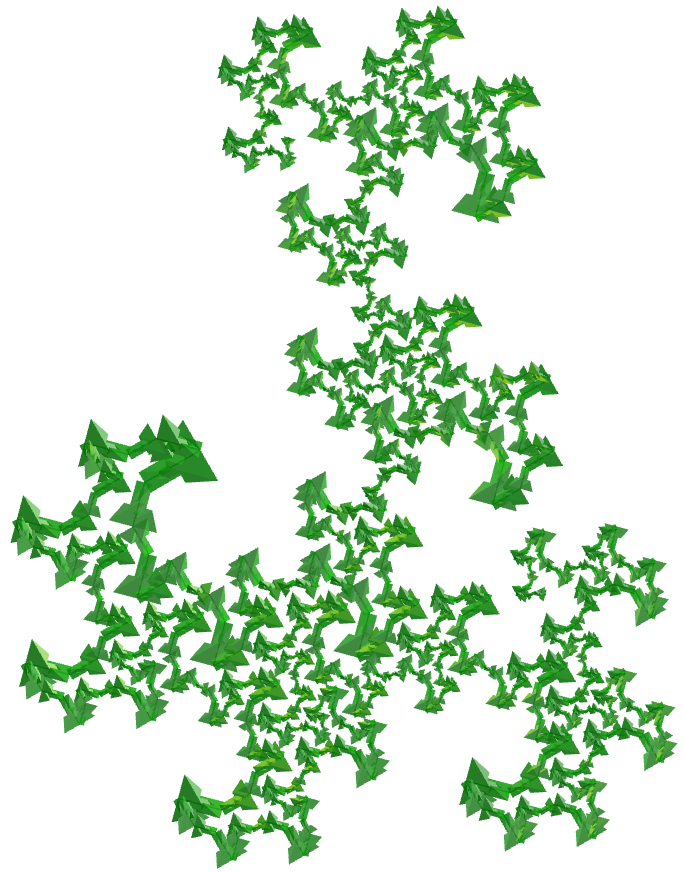</a>
  Fractal dragão de Eva do dodecaedro heptagonal.
  

<a href="#p1" class="topo">voltar ao topo</a>

  Dragon of Eve fractals with polyhedra: visualization with Virtual Reality de <a xmlns:cc="http://creativecommons.org/ns#" href="https://paulohscwb.github.io/fractalcurves/dragoneve/pt-br/" property="cc:attributionName" rel="cc:attributionURL">Paulo Henrique Siqueira</a> está licenciado com uma Licença <a rel="license" href="http://creativecommons.org/licenses/by-nc-nd/4.0/">Creative Commons Atribuição-NãoComercial-SemDerivações 4.0 Internacional</a>.

<h4>Como citar este trabalho:</h4> 

Siqueira, P.H., "Dragon of Eve fractals with polyhedra: visualization with Virtual Reality". Disponível em: <https://paulohscwb.github.io/fractalcurves/dragoneve/pt-br/>, Fevereiro de 2026.

<!---->
  <b>Referências:</b>
 Ventrella, Jeffrey. "Fractal curves". <a href="http://fractalcurves.com/" target="_blank">http://fractalcurves.com/</a>
 Weisstein, Eric W. "Uniform Polyhedron." From MathWorld--A Wolfram Web Resource. <a href="https://mathworld.wolfram.com/UniformPolyhedron.html" target="_blank">https://mathworld.wolfram.com/UniformPolyhedron.html</a>
 McCooey, D. I. "Visual Polyhedra". <a href="http://dmccooey.com/polyhedra/" target="_blank">http://dmccooey.com/polyhedra/</a>
