<link rel="stylesheet" href="../../scripts/style.css">
<meta charset="utf-8">
<link rel="icon" type="image/png" href="../vr/salas/imagens/icone.png">
<h2>Visualização de Curvas Fractais de poliedros em Realidade Virtual (RV) com A-frame</h2>
<b>autor:</b> Paulo Henrique Siqueira - Universidade Federal do Paraná
 <b>contato:</b> <a href="#"> paulohscwb@gmail.com </a>
 <a href="https://paulohscwb.github.io/fractalcurves/holidaytree/">english version</a>
<form style="margin: 0 auto; float:right; text-align:right; width:100%; margin-bottom:15px;">
	<select id="url" onchange="urlHandler(this.value)" style="color:royalblue;">
		<option disabled selected>Mais fractais:</option>
		<option value="../../dragoneve/pt-br/">Dragão de Eve</option>
		<option value="../../et/pt-br/">Curva do E.T., o extra-terrestre</option>
		<option value="../../cat/pt-br/">Curva do gato</option>
		<option value="../../levy/pt-br/">Curva de Lévy</option>
		<option value="../../apple/pt-br/">Curva da maçã</option>
		<option disabled value="../../holidaytree/pt-br/">Curva da árvore de Natal</option>
	</select>
</form>

  <h2 align="center">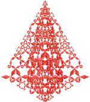 Fractais da curva da árvore de Natal com poliedros</h2>
  A curva fractal da árvore de Natal foi criada por Jeffrey Ventrella em 2019. É uma curva formada por 5 segmentos gerados em cada iteração. Os segmentos maiores formam 30&deg; com os segmentos da iteração anterior, e os três segmentos menores formam um triângulo equilátero.
  
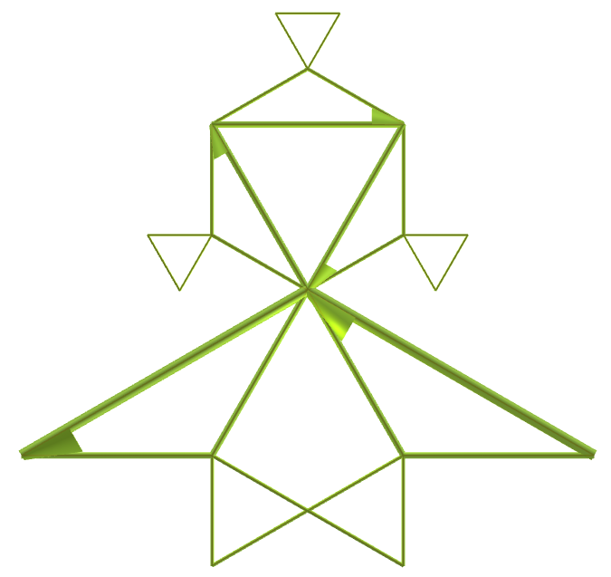

 Este trabalho mostra fractais da curva da árvore de Natal com poliedros, modelados para visualização em Realidade Virtual.
 
<a href="#m3d">Modelos 3D</a>&nbsp;&nbsp;|&nbsp;&nbsp;<a href="../../pt-br/">Página Inicial</a>

  
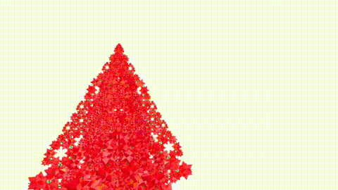
 

<h3 id="m3d" align="center">Modelos 3D</h3>
<!--<iframe width="560" height="315" style="max-width:100%" src="https://www.youtube.com/embed/videoseries?si=zDh9xjDqa51ac9P9&amp;list=PLEgIAfQR8vuA" title="YouTube video player" frameborder="0" allow="accelerometer; autoplay; clipboard-write; encrypted-media; gyroscope; picture-in-picture; web-share" allowfullscreen></iframe>-->
<h4>1. Tetraedro</h4>
<a href="../vr/curve1.htm" target="_blank" title="modelo 3D" class="fotoA">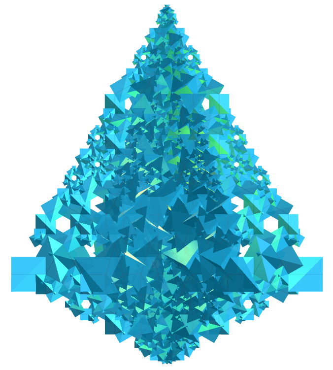</a>
  Aplicando o princípio de construção do fractal da curva da árvore de Natal com o tetraedro, obtemos um fractal da curva da árvore de Natal de tetraedro. Na primeira ordem de construção do fractal, construímos cinco novos tetraedros correspondentes a um poliedro original. Neste exemplo, temos representações de ordens de 0 a 5.
  

<h4>2. Grande dodecaedro</h4>
<a href="../vr/curve6.htm" target="_blank" title="modelo 3D" class="fotoA">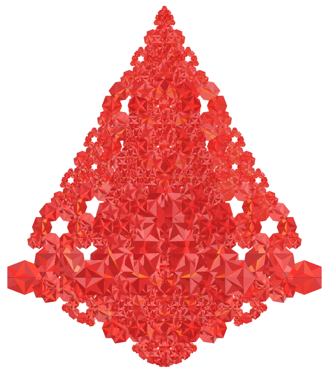</a>
  Fractal de árvore de Natal do grande dodecaedro.
  

<h4>3. Grande icosaedro</h4>
<a href="../vr/curve8.htm" target="_blank" title="modelo 3D" class="fotoA">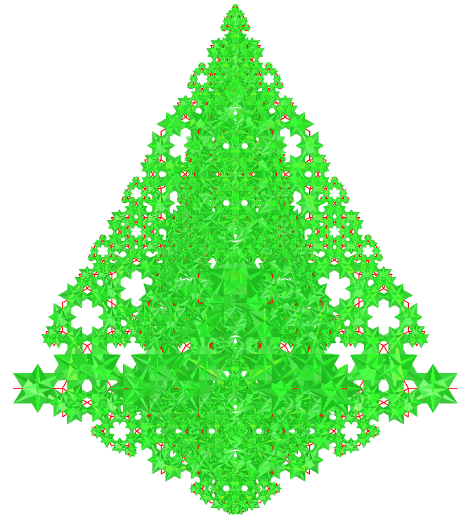</a>
  Fractal de árvore de Natal do Grande icosaedro.
  

<h4>4. Pequeno dodecaedro estrelado</h4>
<a href="../vr/curve11.htm" target="_blank" title="modelo 3D" class="fotoA">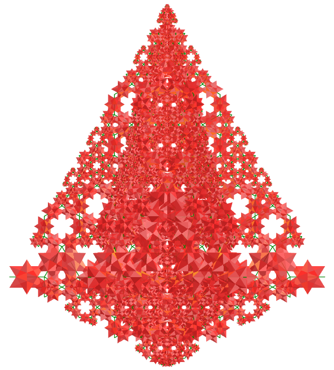</a>
  Fractal de árvore de Natal do pequeno dodecaedro estrelado.
  

<h4>5. Tetrahemihexacron</h4>
<a href="../vr/curve18.htm" target="_blank" title="modelo 3D" class="fotoA">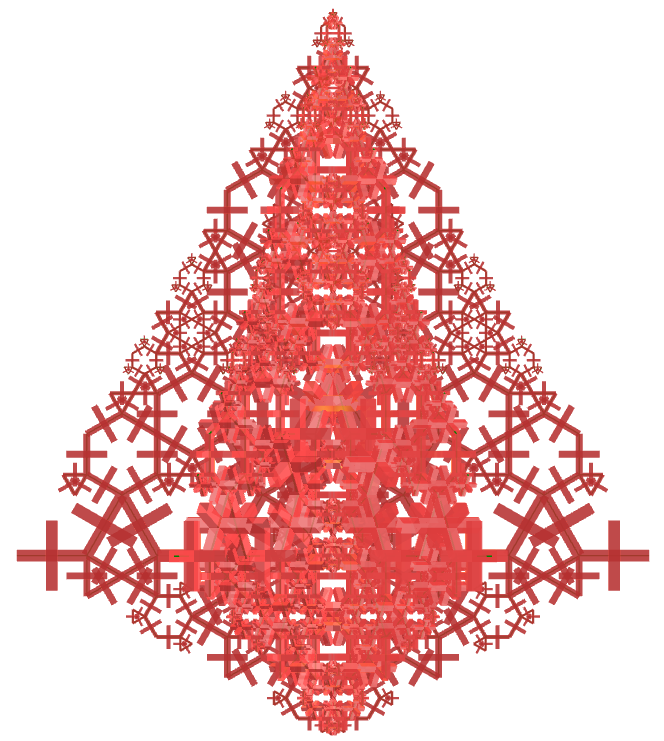</a>
  Fractal de árvore de Natal do tetrahemihexacron.
  

<h4>6. Grande icositetraedro hexacrônico</h4>
<a href="../vr/curve28.htm" target="_blank" title="modelo 3D" class="fotoA">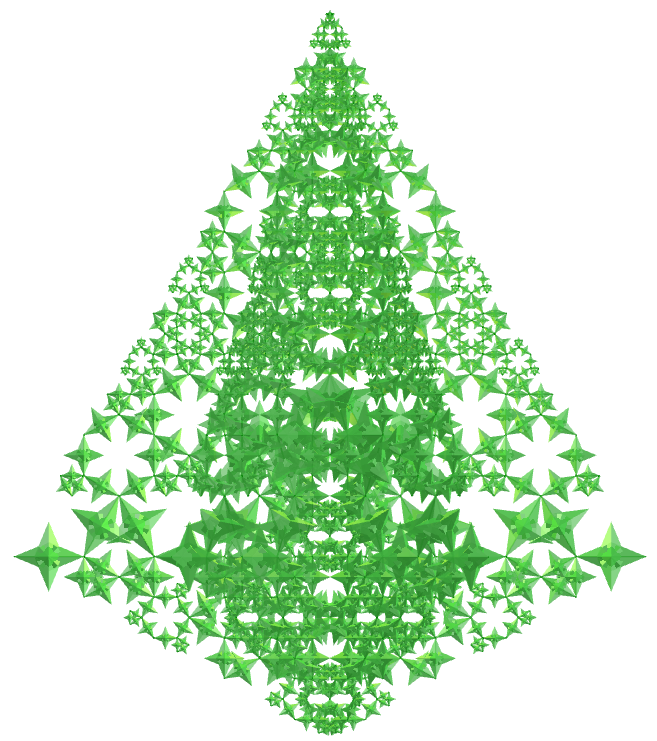</a>
  Fractal de árvore de Natal do grande icositetraedro hexacrônico.
  

<h4>7. Pequeno rombihexacro</h4>
<a href="../vr/curve38.htm" target="_blank" title="modelo 3D" class="fotoA">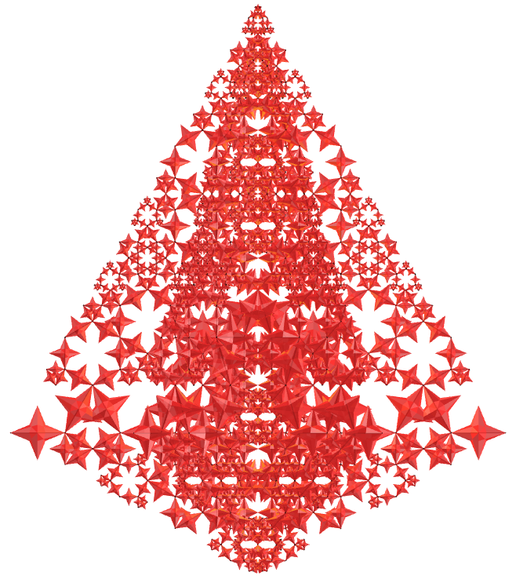</a>
  Fractal de árvore de Natal do pequeno rombihexacro.
  

<h4>8. Hexaedro tetradiakis</h4>
<a href="../vr/curve45.htm" target="_blank" title="modelo 3D" class="fotoA">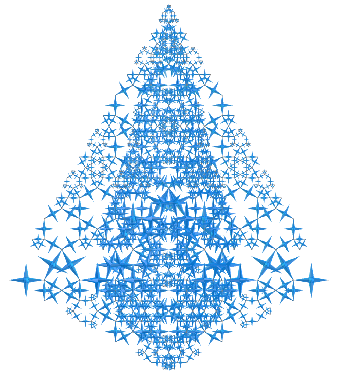</a>
  Fractal de árvore de Natal do hexaedro tetradiakis.
  

<h4>9. Grande dodecaedro disdiakis</h4>
<a href="../vr/curve48.htm" target="_blank" title="modelo 3D" class="fotoA">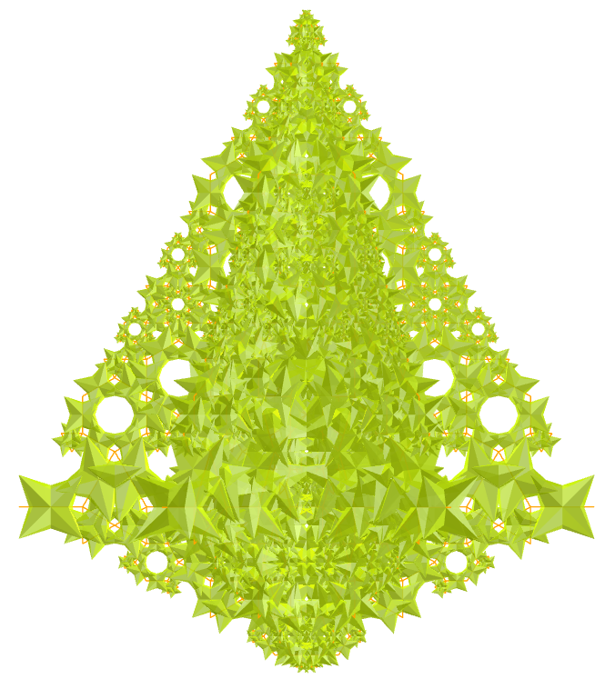</a>
  Fractal de árvore de Natal do grande dodecaedro disdiakis.
  

<h4>10. Grande dodecaedro stellapentakis</h4>
<a href="../vr/curve53.htm" target="_blank" title="modelo 3D" class="fotoA">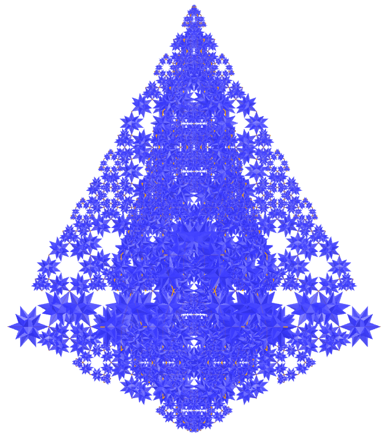</a>
  Fractal de árvore de Natal do grande dodecaedro stellapentakis.
  

<a href="#p1" class="topo">voltar ao topo</a>

<h4>11. Grande icosaedro triakis</h4>
<a href="../vr/curve55.htm" target="_blank" title="modelo 3D" class="fotoA">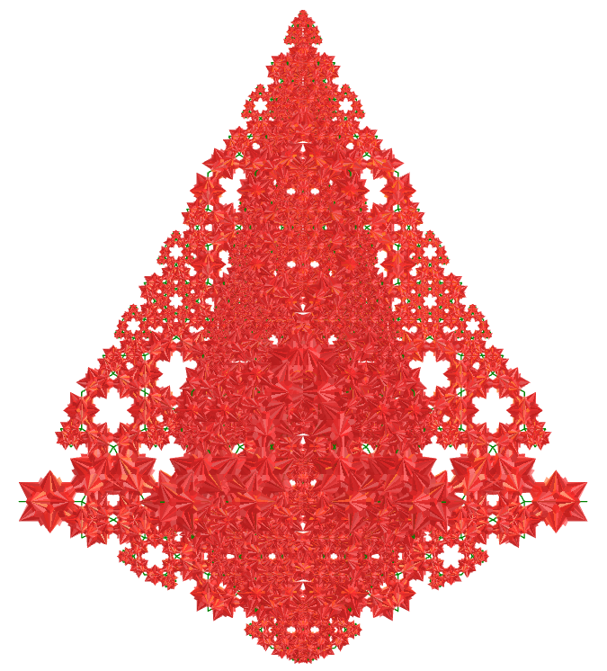</a>
  Fractal de árvore de Natal do grande icosaedro triakis.
  

<h4>12. Cubo truncado combinado</h4>
<a href="../vr/curve57.htm" target="_blank" title="modelo 3D" class="fotoA">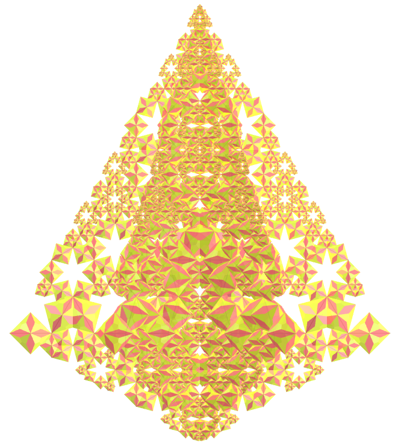</a>
  Fractal de árvore de Natal do cubo truncado combinado.
  

<h4>13. Octaedro chanfrado</h4>
<a href="../vr/curve58.htm" target="_blank" title="modelo 3D" class="fotoA">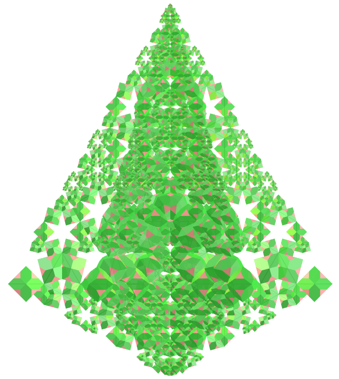</a>
  Fractal de árvore de Natal do octaedro chanfrado.
  

<h4>14. Octaedro triakis</h4>
<a href="../vr/curve60.htm" target="_blank" title="modelo 3D" class="fotoA">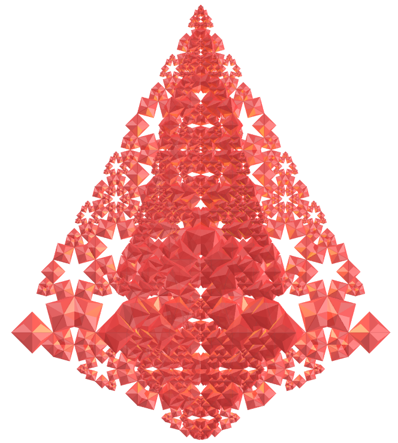</a>
  Fractal de árvore de Natal do octaedro triakis.
  

<h4>15. Mapa de Klein</h4>
<a href="../vr/curve68.htm" target="_blank" title="modelo 3D" class="fotoA">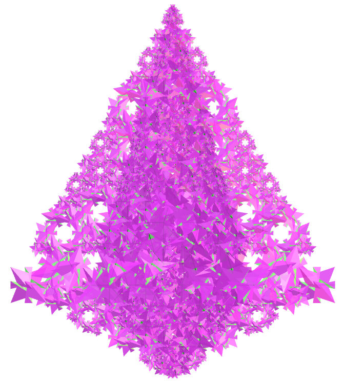</a>
  Fractal de árvore de Natal do mapa de Klein.
  

<h4>16. Toroide hexagonal</h4>
<a href="../vr/curve78.htm" target="_blank" title="modelo 3D" class="fotoA">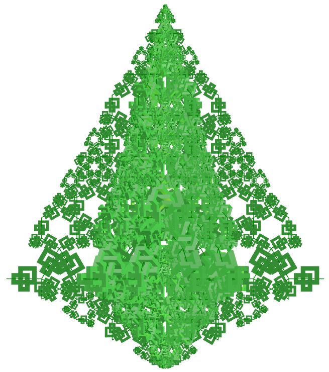</a>
  Fractal de árvore de Natal do toroide hexagonal.
  

<h4>17. Mapa regular</h4>
<a href="../vr/curve88.htm" target="_blank" title="modelo 3D" class="fotoA">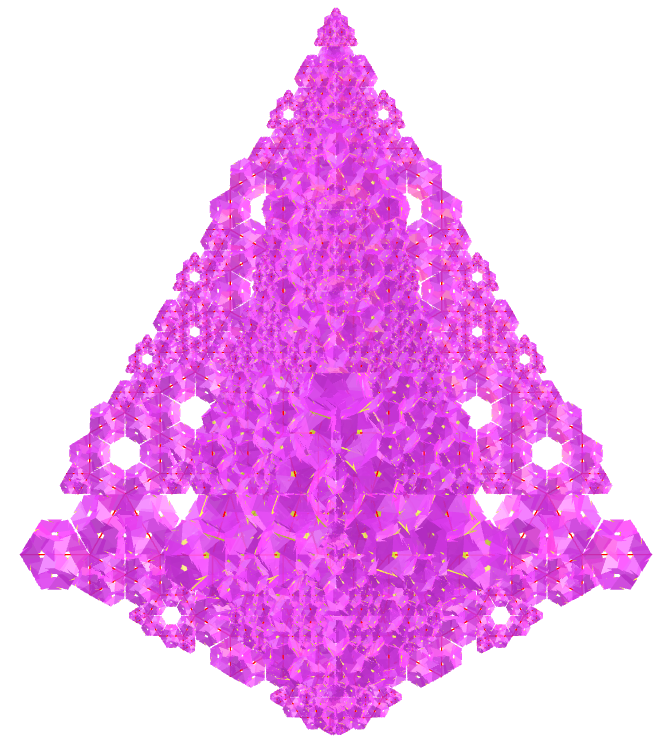</a>
  Fractal de árvore de Natal do mapa regular.
  

<a href="#p1" class="topo">voltar ao topo</a>

  Holiday tree curve fractals with polyhedra: visualization with Virtual Reality de <a xmlns:cc="http://creativecommons.org/ns#" href="https://paulohscwb.github.io/fractalcurves/holidaytree/pt-br/" property="cc:attributionName" rel="cc:attributionURL">Paulo Henrique Siqueira</a> está licenciado com uma Licença <a rel="license" href="http://creativecommons.org/licenses/by-nc-nd/4.0/">Creative Commons Atribuição-NãoComercial-SemDerivações 4.0 Internacional</a>.

<h4>Como citar este trabalho:</h4> 

Siqueira, P.H., "Holiday tree curve fractals with polyhedra: visualization with Virtual Reality". Disponível em: <https://paulohscwb.github.io/fractalcurves/holidaytree/pt-br/>, Agosto de 2026.

<!---->
  <b>Referências:</b>
 Ventrella, Jeffrey. "Fractal curves". <a href="http://fractalcurves.com/" target="_blank">http://fractalcurves.com/</a>
 Weisstein, Eric W. "Uniform Polyhedron." From MathWorld--A Wolfram Web Resource. <a href="https://mathworld.wolfram.com/UniformPolyhedron.html" target="_blank">https://mathworld.wolfram.com/UniformPolyhedron.html</a>
 McCooey, D. I. "Visual Polyhedra". <a href="http://dmccooey.com/polyhedra/" target="_blank">http://dmccooey.com/polyhedra/</a>
