<link rel="stylesheet" href="../../scripts/style.css">
<meta charset="utf-8">
<link rel="icon" type="image/png" href="../vr/salas/imagens/icone.png">
<h2>Visualização de Curvas Fractais de poliedros em Realidade Virtual (RV) com A-frame</h2>
<b>autor:</b> Paulo Henrique Siqueira - Universidade Federal do Paraná
 <b>contato:</b> <a href="#"> paulohscwb@gmail.com </a>
 <a href="https://paulohscwb.github.io/fractalcurves/levy/">english version</a>
<form style="margin: 0 auto; float:right; text-align:right; width:100%; margin-bottom:15px;">
	<select id="url" onchange="urlHandler(this.value)" style="color:royalblue;">
		<option disabled selected>Mais fractais:</option>
		<option value="../../dragoneve/pt-br/">Dragão de Eve</option>
		<option value="../../et/pt-br/">Curva do E.T., o extra-terrestre</option>
		<option value="../../cat/pt-br/">Curva do gato</option>
		<option disabled value="../../levy/pt-br/">Curva de Lévy</option>
	</select>
</form>

  <h2 align="center"> Fractais da curva de Lévy com poliedros</h2>
  A Curva de Lévy, conhecida como Curva C, é um fractal autossimilar descrito pelo matemático italiano Ernesto Cesàro. Porém, esta curva tem o nome do matemático francês Paul Pierre Lévy, que foi responsável pela representação e pela definição do modelo de construção desta curva. Esta curva é formada por 4 segmentos com mesmo tamanho, gerados em cada iteração.
  
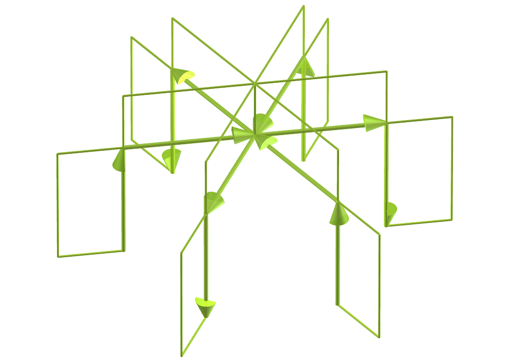

 Este trabalho mostra fractais da curva de Lévy com poliedros, modelados para visualização em Realidade Virtual.
 
<a href="#m3d">Modelos 3D</a>&nbsp;&nbsp;|&nbsp;&nbsp;<a href="../../pt-br/">Página Inicial</a>

  
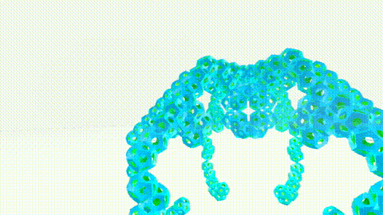
 

<h3 id="m3d" align="center">Modelos 3D</h3>
<!--<iframe width="560" height="315" style="max-width:100%" src="https://www.youtube.com/embed/videoseries?list=PLy0I_lGW8HxWGmFjnLlbixXP2VZLbEBW3" title="YouTube video player" frameborder="0" allow="accelerometer; autoplay; clipboard-write; encrypted-media; gyroscope; picture-in-picture; web-share" allowfullscreen></iframe>-->
<h4>1. Tetraedro</h4>

  Aplicando o princípio de construção do fractal da curva de Lévy com o tetraedro, obtemos um fractal da curva de Lévy de tetraedro. Na primeira ordem de construção do fractal, construímos quatro novos tetraedros correspondentes a um poliedro original. Neste exemplo, temos representações sólidas em ordens de 0 a 5.
  

<h4>2. Icosaedro</h4>
<a href="../vr/curve4.htm" target="_blank" title="modelo 3D" class="fotoA">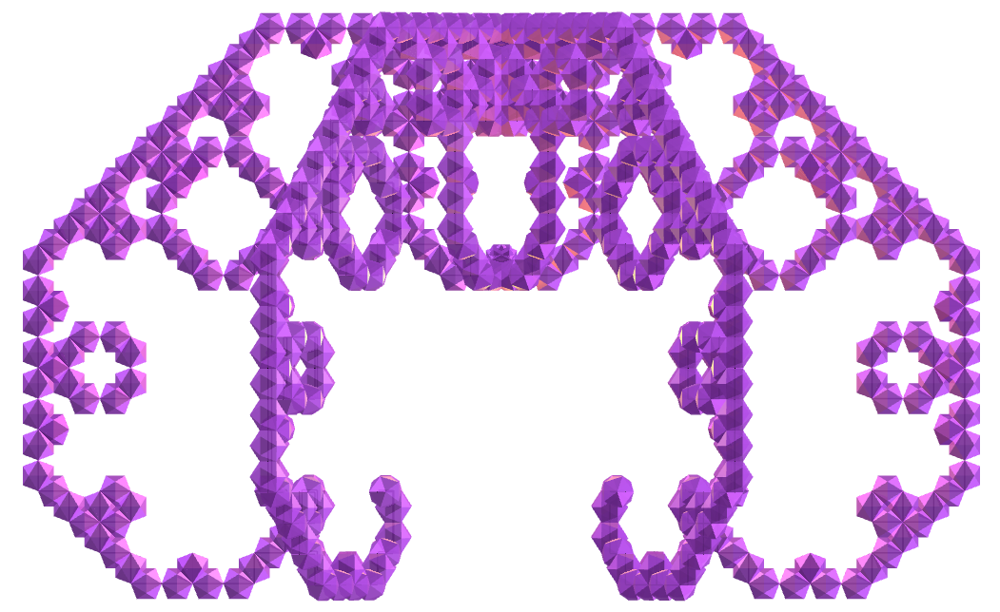</a>
  Fractal da curva de Lévy do icosaedro.
  

<h4>3. Grande dodecaedro</h4>

  Fractal da curva de Lévy do grande dodecaedro.
  

<h4>4. Cubo snub</h4>
<a href="../vr/curve14.htm" target="_blank" title="modelo 3D" class="fotoA">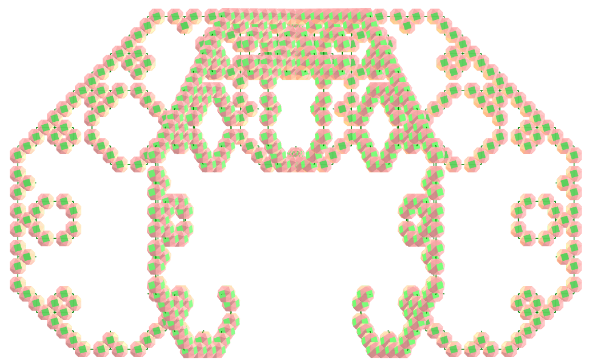</a>
  Fractal da curva de Lévy do cubo snub.
  

<h4>5. Tetrahemihexaedro</h4>
<a href="../vr/curve17.htm" target="_blank" title="modelo 3D" class="fotoA">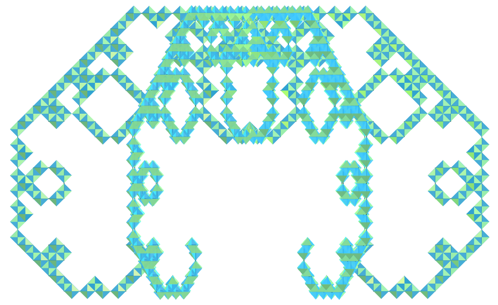</a>
  Fractal da curva de Lévy do tetrahemihexaedro.
  

<h4>6. Pequeno dodecahemicosaedro</h4>
<a href="../vr/curve21.htm" target="_blank" title="modelo 3D" class="fotoA">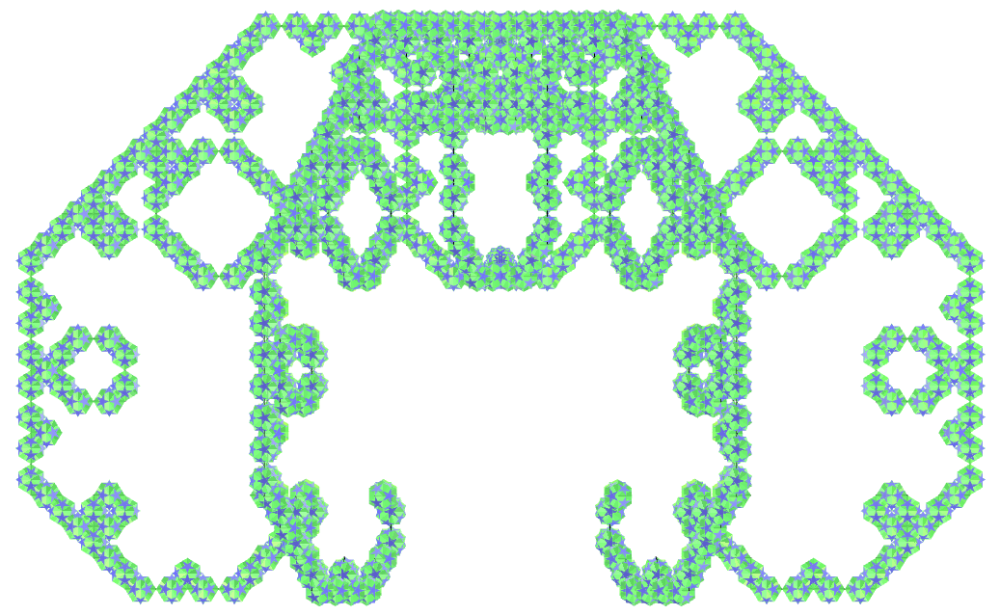</a>
  Fractal da curva de Lévy do pequeno dodecahemicosaedro.
  

<h4>7. Dodecaedro côncavo</h4>

  Fractal da curva de Lévy do dodecaedro côncavo.
  

<h4>8. Grande icosaedro triâmbico</h4>

  Fractal da curva de Lévy do grande icosaedro triâmbico.
  

<h4>9. Cuboctaedro cubitruncado</h4>
<a href="../vr/curve44.htm" target="_blank" title="modelo 3D" class="fotoA">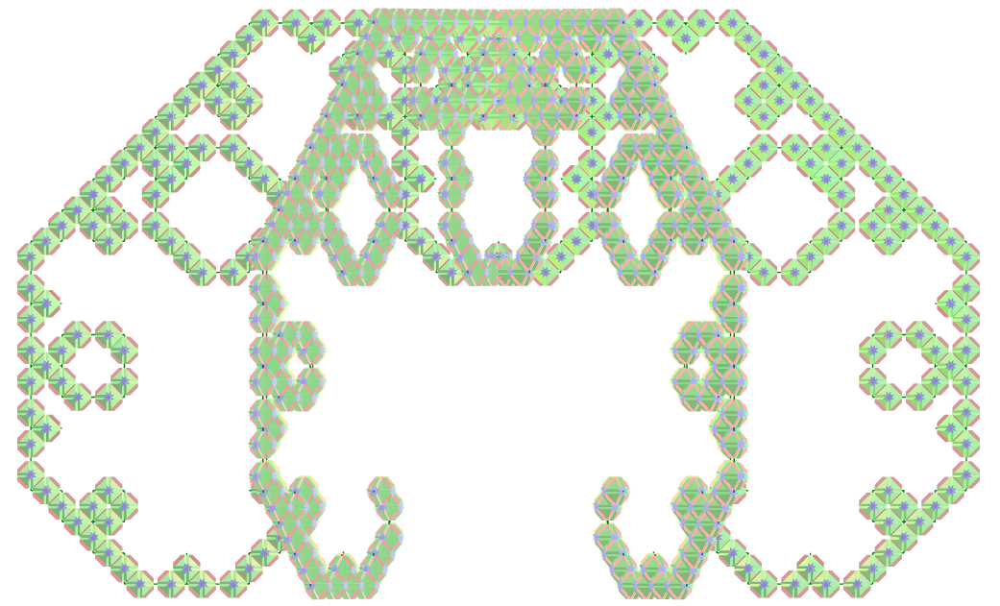</a>
  Fractal da curva de Lévy do cuboctaedro cubitruncado.
  

<h4>10. Triacontaedro disdiakis medial</h4>

  Fractal da curva de Lévy do triacontaedro disdiakis medial.
  

<a href="#p1" class="topo">voltar ao topo</a>

<h4>11. Cubo truncado combinado</h4>
<a href="../vr/curve57.htm" target="_blank" title="modelo 3D" class="fotoA">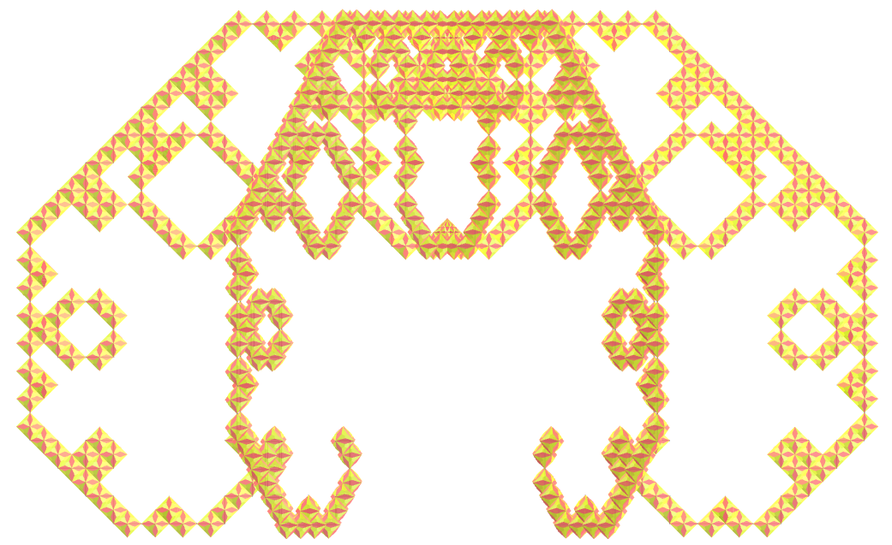</a>
  Fractal da curva de Lévy do cubo truncado combinado.
  

<h4>12. Dodecaedro disdiakis</h4>
<a href="../vr/curve63.htm" target="_blank" title="modelo 3D" class="fotoA">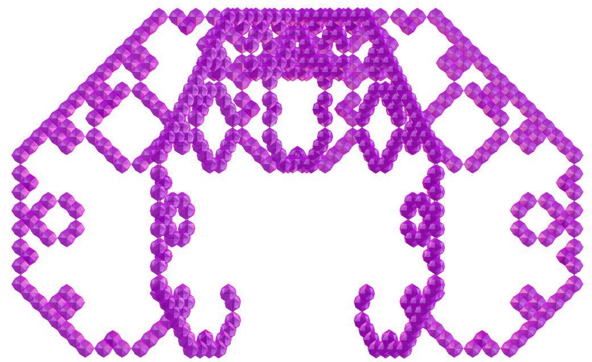</a>
  Fractal da curva de Lévy do dodecaedro disdiakis.
  

<h4>13. Icosidodecaedro</h4>
<a href="../vr/curve64.htm" target="_blank" title="modelo 3D" class="fotoA">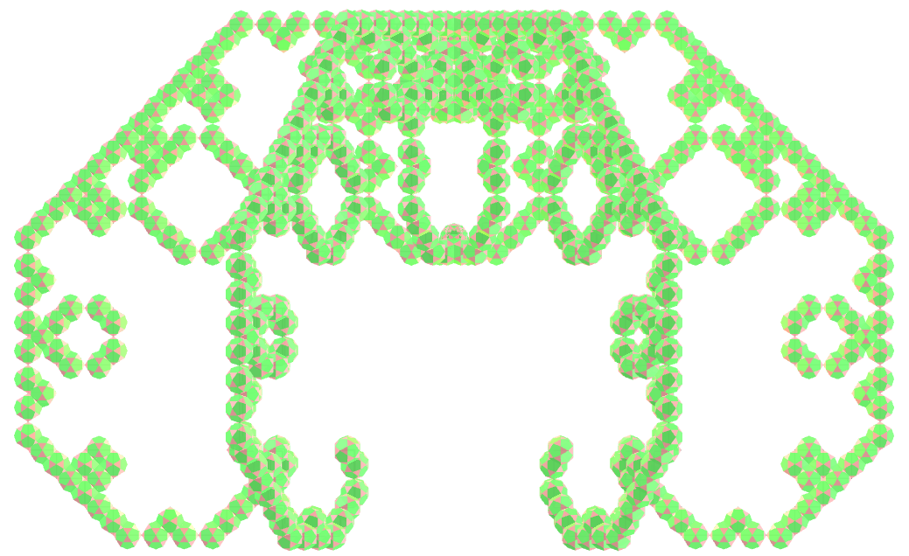</a>
  Fractal da curva de Lévy do icosidodecaedro.
  

<h4>14. Tetraedro triakis</h4>

  Fractal da curva de Lévy do tetraedro triakis.
  

<h4>15. Toroide de Szilassi</h4>
<a href="../vr/curve74.htm" target="_blank" title="modelo 3D" class="fotoA">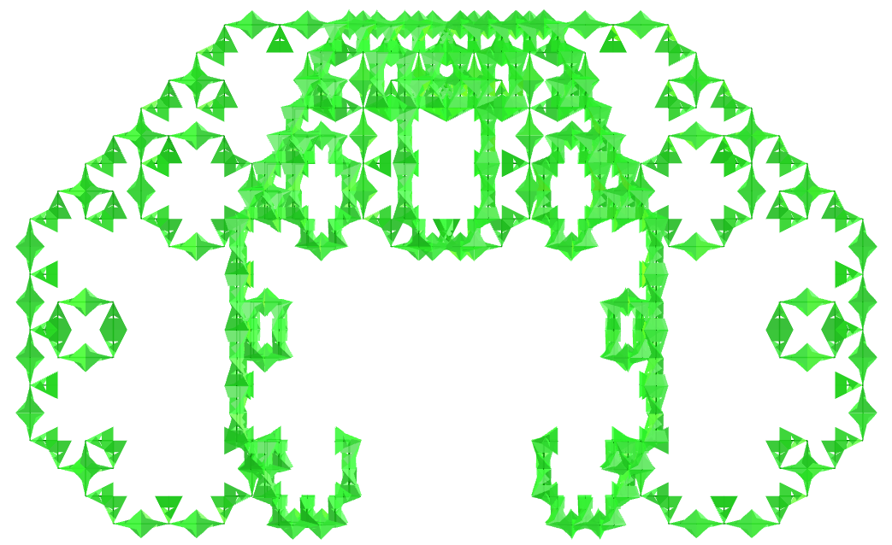</a>
  Fractal da curva de Lévy do toroide de Szilassi.
  

<h4>16. Mapa regular</h4>
<a href="../vr/curve84.htm" target="_blank" title="modelo 3D" class="fotoA">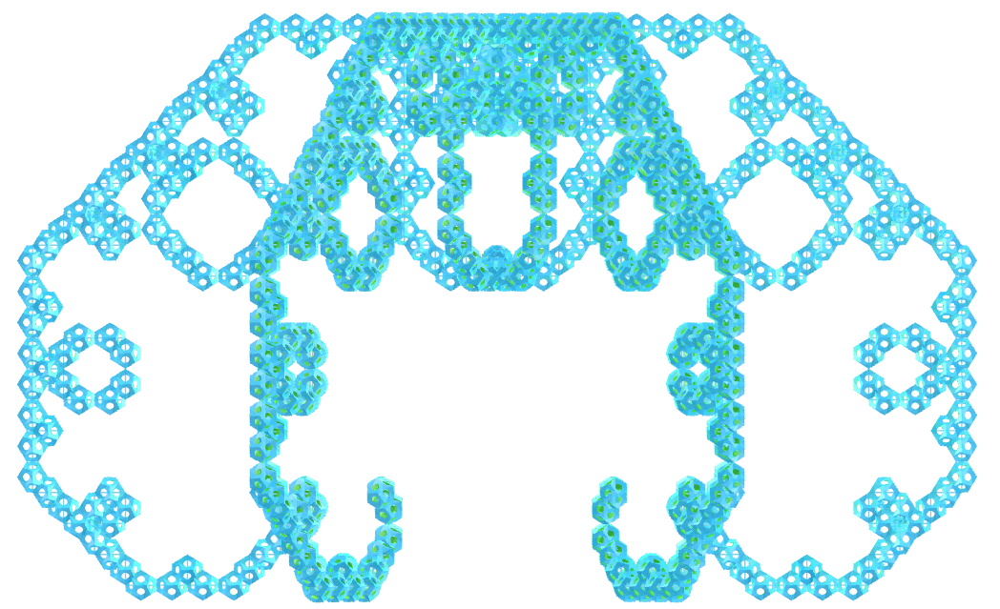</a>
  Fractal da curva de Lévy do mapa regular.
  

<a href="#p1" class="topo">voltar ao topo</a>

  Lévy curve fractals with polyhedra: visualization with Virtual Reality de <a xmlns:cc="http://creativecommons.org/ns#" href="https://paulohscwb.github.io/fractalcurves/levy/pt-br/" property="cc:attributionName" rel="cc:attributionURL">Paulo Henrique Siqueira</a> está licenciado com uma Licença <a rel="license" href="http://creativecommons.org/licenses/by-nc-nd/4.0/">Creative Commons Atribuição-NãoComercial-SemDerivações 4.0 Internacional</a>.

<h4>Como citar este trabalho:</h4> 

Siqueira, P.H., "Lévy curve fractals with polyhedra: visualization with Virtual Reality". Disponível em: <https://paulohscwb.github.io/fractalcurves/levy/pt-br/>, Maio de 2026.

<!---->
  <b>Referências:</b>
 Ventrella, Jeffrey. "Fractal curves". <a href="http://fractalcurves.com/" target="_blank">http://fractalcurves.com/</a>
 Weisstein, Eric W. "Uniform Polyhedron." From MathWorld--A Wolfram Web Resource. <a href="https://mathworld.wolfram.com/UniformPolyhedron.html" target="_blank">https://mathworld.wolfram.com/UniformPolyhedron.html</a>
 McCooey, D. I. "Visual Polyhedra". <a href="http://dmccooey.com/polyhedra/" target="_blank">http://dmccooey.com/polyhedra/</a>
